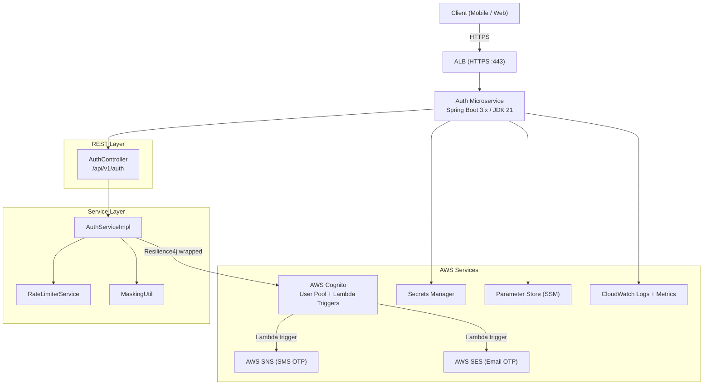
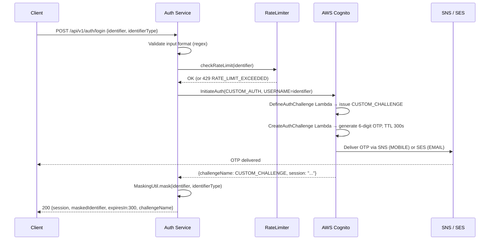
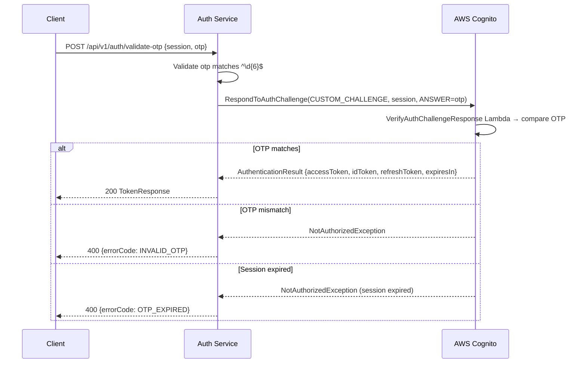
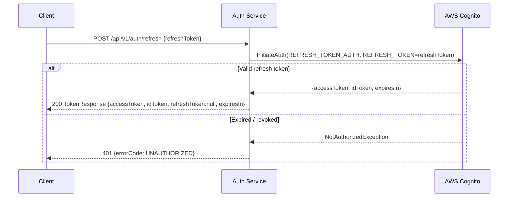
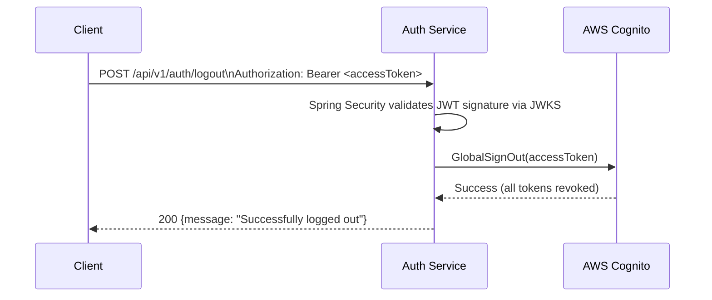

# Design Document: Login OTP Authentication Microservice

## Overview

A production-ready passwordless OTP authentication microservice built with Spring Boot 3.x (Java 21) and AWS Cognito CUSTOM_AUTH flow. Users authenticate using only their mobile phone number or email address — no password required. AWS Cognito orchestrates the custom challenge lifecycle via three Lambda triggers, generating and delivering a 6-digit OTP through AWS SNS (SMS) or SES (email). The microservice acts as a thin orchestration layer that enforces input validation, identifier masking, rate limiting, resilience, and error normalization, then returns standard JWT tokens upon successful OTP verification.

The service is containerized with a multi-stage Docker image, deployed on AWS ECS Fargate behind an ALB with Route53 DNS, and ships with a full GitHub Actions CI/CD pipeline. Secrets and configuration are fetched from AWS Secrets Manager and Parameter Store at startup using the ECS task role — no static credentials anywhere in the codebase or container image.

---

## Architecture

### High-Level Architecture Diagram

```
Internet
   │
   ▼
Route53  (auth.yourdomain.com  A-alias)
   │
   ▼
ALB  (HTTPS :443 → HTTP :8080)
   │
   ▼
ECS Fargate  (private subnets, 2 tasks)
┌──────────────────────────────────────────────────────┐
│  login-otp-auth-microservice (Spring Boot 3.x / JDK 21) │
│                                                      │
│  ┌────────────┐   ┌───────────────────┐              │
│  │ REST Layer │   │  Security Filter  │              │
│  │(Controllers)│   │ (Spring Security) │              │
│  └─────┬──────┘   └───────────────────┘              │
│        │                                             │
│  ┌─────▼──────────────────────────────────────────┐  │
│  │             Service Layer                       │  │
│  │  AuthServiceImpl  │  RateLimiterService         │  │
│  └─────┬──────────────────────────────────────────┘  │
│        │                                             │
│  ┌─────▼──────────────────────────────────────────┐  │
│  │          AWS Integration Layer                  │  │
│  │  CognitoIdentityProviderClient (Resilience4j)   │  │
│  └─────────────────────────────────────────────────┘  │
└──────────────────────────────────────────────────────┘
         │                    │
         ▼                    ▼
  AWS Cognito            AWS Secrets Manager
  (User Pool             & Parameter Store
   + Lambda Triggers)
         │
         ▼
  AWS SNS / SES        AWS CloudWatch
  (OTP delivery)       (Logs + Metrics)
```


### Component Diagram




### Authentication Sequence Diagrams

#### Initiate OTP (Login / Resend)



#### Verify OTP



#### Token Refresh



#### Logout



---

## AWS Services Design

| Service | Role | Configuration |
|---------|------|---------------|
| **Cognito User Pool** | Identity provider, custom auth challenge lifecycle, JWT issuance | CUSTOM_AUTH + REFRESH_TOKEN_AUTH flows only |
| **DefineAuthChallenge Lambda** | Decides whether to issue or skip a custom challenge | Returns `CUSTOM_CHALLENGE` on first call; marks success on valid answer |
| **CreateAuthChallenge Lambda** | Generates 6-digit OTP, stores as private param, triggers delivery | Publishes to SNS (MOBILE) or SES (EMAIL); sets `privateChallengeParameters.answer` |
| **VerifyAuthChallengeResponse Lambda** | Compares user OTP against stored answer | Sets `answerCorrect = true/false` |
| **AWS SNS** | SMS delivery for mobile OTP | `Publish` with `MessageAttributes` for transactional SMS |
| **AWS SES** | Email delivery for email OTP | Verified domain sender; plain-text + HTML template |
| **Secrets Manager** | Cognito Client Secret | Secret name: `auth/cognito-client-secret` |
| **Parameter Store (SSM)** | User Pool ID, Client ID, region | Paths: `/auth/cognito/userPoolId`, `/auth/cognito/clientId` |
| **ALB** | TLS termination, health checks, path routing | `/api/*` → ECS target group; health check `/actuator/health` |
| **Route53** | DNS alias A-record to ALB | `auth.yourdomain.com` → ALB DNS name |
| **CloudWatch Logs** | Structured application logs | Log group `/ecs/auth-microservice`; `awslogs` driver |
| **CloudWatch Metrics** | Custom metrics (OTP sends, success rate, latency) | Namespace `AuthMicroservice` via Micrometer CloudWatch2 |
| **ECR** | Docker image registry | Repository `login-otp-auth`; images tagged with commit SHA + `latest` |
| **IAM Task Role** | Least-privilege access for ECS task | `authMicroserviceTaskRole` — see IAM policy section |

### Cognito User Pool Configuration

```
User Pool settings:
  Sign-in aliases:    email, phone_number
  Required attributes: (none — users pre-exist or are created out-of-band)
  Password policy:    DISABLED (OTP-only; set MinimumLength=8 but never used)
  MFA:                OFF (OTP IS the sole auth factor)

Lambda triggers:
  DefineAuthChallenge         → define-auth-challenge-fn
  CreateAuthChallenge         → create-auth-challenge-fn
  VerifyAuthChallengeResponse → verify-auth-challenge-fn

App Client:
  Allowed auth flows:  ALLOW_CUSTOM_AUTH, ALLOW_REFRESH_TOKEN_AUTH
  Client secret:       optional (server-side flow); include SECRET_HASH if enabled
  Token validity:
    Access Token:  60 minutes
    ID Token:      60 minutes
    Refresh Token: 30 days

Advanced security: AUDIT (recommended) or ENFORCED
```

---

## Spring Boot Package Structure

```
login-otp-auth-microservice/
├── src/
│   ├── main/
│   │   ├── java/com/example/auth/
│   │   │   ├── AuthApplication.java
│   │   │   ├── config/
│   │   │   │   ├── AwsConfig.java            # CognitoIdentityProviderClient bean
│   │   │   │   ├── SecurityConfig.java       # Spring Security + JWT resource server
│   │   │   │   ├── CorsConfig.java           # CORS policy
│   │   │   │   ├── ResilienceConfig.java     # Resilience4j beans
│   │   │   │   └── OpenApiConfig.java        # Springdoc OpenAPI 3.0
│   │   │   ├── controller/
│   │   │   │   └── AuthController.java       # All 6 REST endpoints
│   │   │   ├── service/
│   │   │   │   ├── AuthService.java          # Interface
│   │   │   │   ├── AuthServiceImpl.java      # Cognito orchestration
│   │   │   │   └── RateLimiterService.java   # In-memory rate limiting
│   │   │   ├── dto/
│   │   │   │   ├── request/
│   │   │   │   │   ├── LoginRequest.java
│   │   │   │   │   ├── ValidateOtpRequest.java
│   │   │   │   │   ├── ResendOtpRequest.java
│   │   │   │   │   └── RefreshTokenRequest.java
│   │   │   │   └── response/
│   │   │   │       ├── LoginResponse.java
│   │   │   │       ├── TokenResponse.java
│   │   │   │       ├── UserStatusResponse.java
│   │   │   │       └── ErrorResponse.java
│   │   │   ├── exception/
│   │   │   │   ├── AuthException.java            # Abstract base
│   │   │   │   ├── UserNotFoundException.java
│   │   │   │   ├── UserDisabledException.java
│   │   │   │   ├── OtpException.java
│   │   │   │   ├── OtpErrorCode.java             # Enum: INVALID_OTP, OTP_EXPIRED
│   │   │   │   ├── MaxRetryExceededException.java
│   │   │   │   ├── RateLimitExceededException.java
│   │   │   │   ├── ServiceUnavailableException.java
│   │   │   │   └── GlobalExceptionHandler.java
│   │   │   ├── model/
│   │   │   │   └── IdentifierType.java            # Enum: MOBILE, EMAIL
│   │   │   └── util/
│   │   │       ├── MaskingUtil.java
│   │   │       └── ValidationUtil.java
│   │   └── resources/
│   │       ├── application.yml
│   │       ├── application-dev.yml
│   │       ├── application-staging.yml
│   │       └── application-prod.yml
│   └── test/
│       └── java/com/example/auth/
│           ├── controller/
│           │   └── AuthControllerTest.java       # @WebMvcTest slice
│           ├── service/
│           │   ├── AuthServiceTest.java          # @ExtendWith(MockitoExtension)
│           │   └── RateLimiterServiceTest.java
│           ├── util/
│           │   ├── MaskingUtilTest.java          # Unit + jqwik property tests
│           │   └── MaskingUtilPropertyTest.java
│           └── integration/
│               └── AuthIntegrationTest.java      # @SpringBootTest + LocalStack
├── infra/
│   ├── ecs/
│   │   ├── task-definition.json
│   │   └── service-definition.json
│   └── k8s/                                     # Optional EKS alternative
│       ├── namespace.yaml
│       ├── deployment.yaml
│       ├── service.yaml
│       ├── ingress.yaml
│       ├── configmap.yaml
│       ├── secret.yaml
│       └── hpa.yaml
├── .github/workflows/
│   ├── ci.yml
│   └── cd.yml
├── Dockerfile
├── .dockerignore
└── pom.xml
```

---

## Components and Interfaces

### AuthController

**Purpose**: Single REST controller exposing all 6 authentication endpoints. Delegates all business logic to `AuthService`. Handles Bearer token extraction for protected endpoints.

```java
@RestController
@RequestMapping("/api/v1/auth")
@Validated
@RequiredArgsConstructor
@Slf4j
@Tag(name = "Authentication", description = "Passwordless OTP authentication via AWS Cognito")
public class AuthController {

    private final AuthService authService;

    /**
     * Initiate OTP login. Triggers Cognito CUSTOM_AUTH and delivers OTP via SNS/SES.
     * @param request identifier + identifierType
     * @return session, maskedIdentifier, expiresIn, challengeName
     */
    @Operation(summary = "Initiate OTP login")
    @ApiResponses({
        @ApiResponse(responseCode = "200", description = "OTP sent",
            content = @Content(schema = @Schema(implementation = LoginResponse.class))),
        @ApiResponse(responseCode = "400", description = "Invalid input",
            content = @Content(schema = @Schema(implementation = ErrorResponse.class))),
        @ApiResponse(responseCode = "404", description = "User not found"),
        @ApiResponse(responseCode = "429", description = "Rate limit exceeded"),
        @ApiResponse(responseCode = "503", description = "Cognito unavailable")
    })
    @PostMapping("/login")
    public ResponseEntity<LoginResponse> login(@Valid @RequestBody LoginRequest request);

    /**
     * Validate OTP and receive JWT tokens on success.
     */
    @PostMapping("/validate-otp")
    public ResponseEntity<TokenResponse> validateOtp(
        @Valid @RequestBody ValidateOtpRequest request);

    /**
     * Resend a fresh OTP, invalidating any previous session for the identifier.
     */
    @PostMapping("/resend-otp")
    public ResponseEntity<LoginResponse> resendOtp(
        @Valid @RequestBody ResendOtpRequest request);

    /**
     * Exchange a valid refresh token for a new access + ID token pair.
     */
    @PostMapping("/refresh")
    public ResponseEntity<TokenResponse> refresh(
        @Valid @RequestBody RefreshTokenRequest request);

    /**
     * Global sign-out — revokes all tokens for the authenticated user.
     * Protected: requires valid Bearer token.
     */
    @SecurityRequirement(name = "bearerAuth")
    @PostMapping("/logout")
    public ResponseEntity<Map<String, String>> logout(
        @AuthenticationPrincipal Jwt jwt);

    /**
     * Get the authenticated user's Cognito account status.
     * Protected: requires valid Bearer token.
     */
    @SecurityRequirement(name = "bearerAuth")
    @GetMapping("/status")
    public ResponseEntity<UserStatusResponse> getUserStatus(
        @AuthenticationPrincipal Jwt jwt);
}
```

### AuthService Interface

```java
/**
 * Orchestrates OTP-based authentication against AWS Cognito CUSTOM_AUTH flow.
 */
public interface AuthService {

    /**
     * Initiate a Cognito CUSTOM_AUTH challenge. Triggers Lambda to generate and deliver OTP.
     * @param request identifier + identifierType
     * @return session, maskedIdentifier, expiresIn=300, challengeName="CUSTOM_CHALLENGE"
     * @throws UserNotFoundException if identifier not found in Cognito
     * @throws UserDisabledException if Cognito user is disabled
     * @throws RateLimitExceededException if rate limit exceeded for identifier
     * @throws ServiceUnavailableException on Cognito service errors
     */
    LoginResponse initiateLogin(LoginRequest request);

    /**
     * Submit the user-provided OTP to Cognito to complete the auth challenge.
     * @param request session + 6-digit otp
     * @return accessToken, idToken, refreshToken, tokenType, expiresIn
     * @throws OtpException(INVALID_OTP) on OTP mismatch
     * @throws OtpException(OTP_EXPIRED) on session/OTP expiry
     * @throws MaxRetryExceededException on too many failed attempts
     */
    TokenResponse validateOtp(ValidateOtpRequest request);

    /**
     * Resend OTP by initiating a fresh Cognito auth challenge.
     * Rate limits apply (same counter as login).
     */
    LoginResponse resendOtp(ResendOtpRequest request);

    /**
     * Refresh access + ID tokens using a valid refresh token.
     * @return TokenResponse with refreshToken always null
     * @throws AuthException(UNAUTHORIZED) if refresh token is expired or revoked
     */
    TokenResponse refreshToken(RefreshTokenRequest request);

    /**
     * Globally revoke all tokens for the user associated with the access token.
     * @param accessToken raw JWT access token (not the Bearer prefix)
     */
    void logout(String accessToken);

    /**
     * Retrieve the authenticated user's Cognito account status.
     * @param accessToken raw JWT access token
     */
    UserStatusResponse getUserStatus(String accessToken);
}
```

### RateLimiterService

**Purpose**: Enforces maximum 3 OTP send requests per identifier per 10-minute rolling window using an in-memory `ConcurrentHashMap`. For multi-instance deployments, swap the store to Redis.

```java
/**
 * Per-identifier rate limiter: max {@code maxAttempts} per {@code windowMinutes} rolling window.
 */
@Service
public class RateLimiterService {

    /** Thread-safe map: identifier → list of request timestamps in the current window. */
    private final ConcurrentHashMap<String, List<Instant>> requestLog = new ConcurrentHashMap<>();

    @Value("${cognito.max-resend-attempts:3}")
    private int maxAttempts;

    @Value("${cognito.resend-window-minutes:10}")
    private int windowMinutes;

    /**
     * Check and record an OTP send attempt.
     * Removes timestamps outside the rolling window before checking.
     *
     * @param identifier phone or email
     * @throws RateLimitExceededException if the identifier has reached maxAttempts
     *                                    in the last windowMinutes
     */
    public void checkAndRecord(String identifier);

    /**
     * Returns the number of remaining allowed attempts for the identifier
     * within the current rolling window.
     */
    public int remainingAttempts(String identifier);
}
```

### MaskingUtil

**Purpose**: Masks identifiers before including them in any API response so that sensitive data is never fully exposed over the network.

```java
@Component
public class MaskingUtil {

    /**
     * Mask an identifier based on its type.
     * @param identifier raw phone or email string
     * @param type MOBILE or EMAIL
     * @return masked string
     */
    public String mask(String identifier, IdentifierType type) {
        return switch (type) {
            case MOBILE -> maskPhone(identifier);
            case EMAIL  -> maskEmail(identifier);
        };
    }

    /**
     * Phone masking rule:
     *   - Preserve '+' prefix
     *   - Preserve last 4 digits
     *   - Replace all intermediate digits with '*'
     *
     * Examples:
     *   "+12025551234"  → "+1*****1234"
     *   "+447911123456" → "+44*****3456"
     */
    String maskPhone(String phone);

    /**
     * Email masking rule:
     *   - Preserve first character of local part
     *   - Replace remaining local-part characters (before '@') with '*'
     *   - Preserve full domain (everything from '@' onward)
     *
     * Examples:
     *   "alice@example.com"       → "a****@example.com"
     *   "bob.smith@company.co.uk" → "b********@company.co.uk"
     */
    String maskEmail(String email);
}
```

---

## Data Models

### Request DTOs

```java
// POST /api/v1/auth/login
public record LoginRequest(
    @NotBlank(message = "identifier is required")
    @Pattern(
        regexp = "^(\\+[1-9]\\d{7,14}|[^@\\s]+@[^@\\s]+\\.[^@\\s]+)$",
        message = "identifier must be a valid E.164 phone number or email address"
    )
    String identifier,

    @NotNull(message = "identifierType is required")
    IdentifierType identifierType
) {}

// POST /api/v1/auth/validate-otp
public record ValidateOtpRequest(
    @NotBlank(message = "session is required")
    String session,

    @NotBlank(message = "otp is required")
    @Pattern(regexp = "^\\d{6}$", message = "otp must be exactly 6 digits")
    String otp
) {}

// POST /api/v1/auth/resend-otp  (same fields as LoginRequest)
public record ResendOtpRequest(
    @NotBlank String identifier,
    @NotNull  IdentifierType identifierType
) {}

// POST /api/v1/auth/refresh
public record RefreshTokenRequest(
    @NotBlank(message = "refreshToken is required")
    String refreshToken
) {}

// Enum used by LoginRequest and ResendOtpRequest
public enum IdentifierType { MOBILE, EMAIL }
```

### Response DTOs

```java
// 200 from POST /login and POST /resend-otp
public record LoginResponse(
    String session,           // Cognito session string (opaque, pass back to validate-otp)
    String maskedIdentifier,  // "+1*****1234" or "a****@example.com"
    int    expiresIn,         // OTP TTL in seconds: always 300
    String challengeName      // always "CUSTOM_CHALLENGE"
) {}

// 200 from POST /validate-otp and POST /refresh
public record TokenResponse(
    String accessToken,    // Cognito Access JWT
    String idToken,        // Cognito ID JWT
    String refreshToken,   // Cognito Refresh Token (null on /refresh response)
    String tokenType,      // always "Bearer"
    int    expiresIn       // access token TTL in seconds: 3600
) {}

// 200 from GET /status
public record UserStatusResponse(
    String  sub,
    String  username,
    String  email,
    String  phoneNumber,
    String  status,          // CONFIRMED | UNCONFIRMED | DISABLED
    boolean enabled,
    Instant createdAt,
    Instant lastModifiedAt
) {}

// All 4xx / 5xx error responses
public record ErrorResponse(
    String  errorCode,   // e.g. "OTP_EXPIRED"
    String  message,
    Instant timestamp,
    String  path
) {}
```

---

## Exception Hierarchy

```java
// ─── Base ───────────────────────────────────────────────────────────────────
/**
 * Base exception for all domain authentication errors.
 * Carries a machine-readable errorCode and an HttpStatus for the response.
 */
public abstract class AuthException extends RuntimeException {
    private final String     errorCode;
    private final HttpStatus httpStatus;

    protected AuthException(String errorCode, String message, HttpStatus httpStatus) {
        super(message);
        this.errorCode  = errorCode;
        this.httpStatus = httpStatus;
    }
    public String     getErrorCode()  { return errorCode; }
    public HttpStatus getHttpStatus() { return httpStatus; }
}

// ─── Specific exceptions ─────────────────────────────────────────────────────
public class UserNotFoundException extends AuthException {
    public UserNotFoundException(String message) {
        super("USER_NOT_FOUND", message, HttpStatus.NOT_FOUND);
    }
}

public class UserDisabledException extends AuthException {
    public UserDisabledException(String message) {
        super("USER_DISABLED", message, HttpStatus.FORBIDDEN);
    }
}

public enum OtpErrorCode {
    INVALID_OTP("OTP does not match"),
    OTP_EXPIRED("OTP or session has expired");

    private final String message;
    OtpErrorCode(String message) { this.message = message; }
    public String getMessage() { return message; }
}

public class OtpException extends AuthException {
    public OtpException(OtpErrorCode code) {
        super(code.name(), code.getMessage(), HttpStatus.BAD_REQUEST);
    }
}

public class MaxRetryExceededException extends AuthException {
    public MaxRetryExceededException(String message) {
        super("MAX_RETRY_EXCEEDED", message, HttpStatus.BAD_REQUEST);
    }
}

public class RateLimitExceededException extends AuthException {
    public RateLimitExceededException(String message) {
        super("RATE_LIMIT_EXCEEDED", message, HttpStatus.TOO_MANY_REQUESTS);
    }
}

public class ServiceUnavailableException extends AuthException {
    public ServiceUnavailableException(String message) {
        super("COGNITO_UNAVAILABLE", message, HttpStatus.SERVICE_UNAVAILABLE);
    }
}
```

---

## Global Exception Handler

```java
@Slf4j
@RestControllerAdvice
public class GlobalExceptionHandler {

    // ── Domain exceptions → structured ErrorResponse ─────────────────────────
    @ExceptionHandler(AuthException.class)
    public ResponseEntity<ErrorResponse> handleAuthException(
            AuthException ex, HttpServletRequest request) {
        log.warn("Auth error [{}]: {}", ex.getErrorCode(), ex.getMessage());
        return ResponseEntity
            .status(ex.getHttpStatus())
            .body(new ErrorResponse(ex.getErrorCode(), ex.getMessage(),
                                    Instant.now(), request.getRequestURI()));
    }

    // ── Bean validation failures → INVALID_INPUT ─────────────────────────────
    @ExceptionHandler(MethodArgumentNotValidException.class)
    public ResponseEntity<ErrorResponse> handleValidation(
            MethodArgumentNotValidException ex, HttpServletRequest request) {
        String message = ex.getBindingResult().getFieldErrors().stream()
            .map(FieldError::getDefaultMessage)
            .collect(Collectors.joining("; "));
        return ResponseEntity.badRequest()
            .body(new ErrorResponse("INVALID_INPUT", message,
                                    Instant.now(), request.getRequestURI()));
    }

    // ── Cognito SDK exceptions → mapped domain exceptions ────────────────────
    @ExceptionHandler(CognitoIdentityProviderException.class)
    public ResponseEntity<ErrorResponse> handleCognitoException(
            CognitoIdentityProviderException ex, HttpServletRequest request) {
        // Re-throw as domain exception so the AuthException handler picks it up
        RuntimeException mapped = mapCognitoException(ex);
        if (mapped instanceof AuthException ae) {
            return handleAuthException(ae, request);
        }
        return handleGeneric(ex, request);
    }

    // ── Catch-all ─────────────────────────────────────────────────────────────
    @ExceptionHandler(Exception.class)
    public ResponseEntity<ErrorResponse> handleGeneric(
            Exception ex, HttpServletRequest request) {
        log.error("Unhandled exception on {}", request.getRequestURI(), ex);
        return ResponseEntity.status(HttpStatus.INTERNAL_SERVER_ERROR)
            .body(new ErrorResponse("INTERNAL_ERROR", "An unexpected error occurred",
                                    Instant.now(), request.getRequestURI()));
    }

    // ── Cognito exception mapping switch ──────────────────────────────────────
    /**
     * Maps AWS Cognito SDK exceptions to typed domain exceptions.
     * Exhaustive: every known Cognito error code is handled.
     */
    private RuntimeException mapCognitoException(CognitoIdentityProviderException ex) {
        String code = ex.awsErrorDetails().errorCode();
        return switch (code) {
            case "UserNotFoundException"    -> new UserNotFoundException(ex.getMessage());
            case "NotAuthorizedException"   -> mapNotAuthorized(ex);
            case "UserNotConfirmedException"-> new UserDisabledException("User not confirmed");
            case "TooManyRequestsException" -> new RateLimitExceededException(ex.getMessage());
            case "ExpiredCodeException"     -> new OtpException(OtpErrorCode.OTP_EXPIRED);
            case "CodeMismatchException"    -> new OtpException(OtpErrorCode.INVALID_OTP);
            case "LimitExceededException"   -> new RateLimitExceededException(ex.getMessage());
            default -> new ServiceUnavailableException("Cognito error: " + ex.getMessage());
        };
    }

    /**
     * NotAuthorizedException carries the specific reason in its message.
     * Discriminate by message content to produce the right domain exception.
     */
    private RuntimeException mapNotAuthorized(CognitoIdentityProviderException ex) {
        String msg = ex.getMessage() == null ? "" : ex.getMessage().toLowerCase(Locale.ROOT);
        if (msg.contains("disabled"))       return new UserDisabledException(ex.getMessage());
        if (msg.contains("attempt limit"))  return new MaxRetryExceededException(ex.getMessage());
        if (msg.contains("expired"))        return new OtpException(OtpErrorCode.OTP_EXPIRED);
        return new OtpException(OtpErrorCode.INVALID_OTP);
    }
}
```

---

## Key Functions with Formal Specifications

### AuthServiceImpl.initiateLogin()

```java
/**
 * Initiate Cognito CUSTOM_AUTH flow for the given identifier.
 * Checks rate limit before calling Cognito.
 *
 * @param request non-null, pre-validated LoginRequest
 * @return LoginResponse with session, maskedIdentifier, expiresIn, challengeName
 */
@CircuitBreaker(name = "cognito", fallbackMethod = "cognitoFallback")
@Retry(name = "cognito")
public LoginResponse initiateLogin(LoginRequest request)
```

**Preconditions:**
- `request` is non-null and has passed `@Valid` constraints
- `request.identifier()` conforms to its `identifierType` format rules
- The identifier exists in the Cognito User Pool and the account is enabled
- Rate limit has not been exceeded for this identifier

**Postconditions:**
- Returns `LoginResponse` with `session` non-blank, `expiresIn == 300`, `challengeName == "CUSTOM_CHALLENGE"`
- `maskedIdentifier` satisfies masking safety properties (see Masking section)
- The rate limiter has recorded one attempt for this identifier
- No JWT tokens are issued at this stage
- On `UserNotFoundException` → throws `UserNotFoundException` (HTTP 404)
- On disabled user → throws `UserDisabledException` (HTTP 403)
- On rate limit exceeded → throws `RateLimitExceededException` (HTTP 429) before calling Cognito
- On Cognito service error → throws `ServiceUnavailableException` (HTTP 503)

**Algorithm:**

```pascal
PROCEDURE initiateLogin(request)
  INPUT:  request (identifier: String, identifierType: IdentifierType)
  OUTPUT: LoginResponse

  SEQUENCE
    // 1. Check rate limit — throws RateLimitExceededException if exceeded
    rateLimiterService.checkAndRecord(request.identifier())

    // 2. Build Cognito InitiateAuth parameters
    authParams ← {"USERNAME": request.identifier()}
    IF clientSecret IS NOT BLANK THEN
      authParams["SECRET_HASH"] ← calculateSecretHash(request.identifier())
    END IF

    cognitoReq ← InitiateAuthRequest {
      authFlow:       CUSTOM_AUTH,
      clientId:       cognitoClientId,
      authParameters: authParams
    }

    // 3. Call Cognito — Resilience4j applies retry + circuit breaker
    TRY
      cognitoResp ← cognitoClient.initiateAuth(cognitoReq)
    CATCH UserNotFoundException      → THROW UserNotFoundException
    CATCH NotAuthorizedException(disabled) → THROW UserDisabledException
    CATCH TooManyRequestsException   → THROW RateLimitExceededException
    CATCH CognitoIdentityProviderException → THROW ServiceUnavailableException

    // 4. Assert Cognito returned the expected challenge
    ASSERT cognitoResp.challengeName() == CUSTOM_CHALLENGE

    // 5. Mask identifier and build response
    masked ← maskingUtil.mask(request.identifier(), request.identifierType())

    RETURN LoginResponse {
      session:          cognitoResp.session(),
      maskedIdentifier: masked,
      expiresIn:        otpTtlSeconds,    // 300
      challengeName:    "CUSTOM_CHALLENGE"
    }
  END SEQUENCE
END PROCEDURE
```

**Loop Invariants:** N/A (no loops)

---

### AuthServiceImpl.validateOtp()

```java
/**
 * Submit the user-provided OTP to Cognito to complete the CUSTOM_CHALLENGE.
 *
 * @param request non-null ValidateOtpRequest with session and 6-digit otp
 * @return TokenResponse containing accessToken, idToken, refreshToken, expiresIn
 */
@CircuitBreaker(name = "cognito", fallbackMethod = "cognitoFallback")
@Retry(name = "cognito")
public TokenResponse validateOtp(ValidateOtpRequest request)
```

**Preconditions:**
- `request.session()` is non-blank and was issued by a prior `initiateLogin` or `resendOtp` call
- `request.otp()` matches `^\d{6}$`
- The session is still within its TTL

**Postconditions:**
- On success: returns `TokenResponse` with non-null `accessToken`, `idToken`, `refreshToken`; `tokenType == "Bearer"`; `expiresIn == 3600`
- All tokens are valid JWTs signed by Cognito User Pool JWKS
- On OTP mismatch → throws `OtpException(INVALID_OTP)` (HTTP 400)
- On session expiry → throws `OtpException(OTP_EXPIRED)` (HTTP 400)
- On retry limit exceeded → throws `MaxRetryExceededException` (HTTP 400)

**Algorithm:**

```pascal
PROCEDURE validateOtp(request)
  INPUT:  request (session: String, otp: String)
  OUTPUT: TokenResponse

  SEQUENCE
    // 1. Build challenge response parameters
    challengeResponses ← {
      "USERNAME": extractUsernameFromSession(request.session()),
      "ANSWER":   request.otp()
    }
    IF clientSecret IS NOT BLANK THEN
      username ← extractUsernameFromSession(request.session())
      challengeResponses["SECRET_HASH"] ← calculateSecretHash(username)
    END IF

    cognitoReq ← RespondToAuthChallengeRequest {
      clientId:           cognitoClientId,
      challengeName:      CUSTOM_CHALLENGE,
      session:            request.session(),
      challengeResponses: challengeResponses
    }

    // 2. Submit to Cognito
    TRY
      cognitoResp ← cognitoClient.respondToAuthChallenge(cognitoReq)
    CATCH NotAuthorizedException(attempt limit) → THROW MaxRetryExceededException
    CATCH NotAuthorizedException(expired)       → THROW OtpException(OTP_EXPIRED)
    CATCH NotAuthorizedException                → THROW OtpException(INVALID_OTP)
    CATCH ExpiredCodeException                  → THROW OtpException(OTP_EXPIRED)
    CATCH CodeMismatchException                 → THROW OtpException(INVALID_OTP)

    // 3. Validate authentication result present
    IF cognitoResp.authenticationResult() IS NULL THEN
      // Cognito returned another challenge — OTP was wrong
      THROW OtpException(INVALID_OTP)
    END IF

    auth ← cognitoResp.authenticationResult()

    // 4. Return token response
    RETURN TokenResponse {
      accessToken:  auth.accessToken(),
      idToken:      auth.idToken(),
      refreshToken: auth.refreshToken(),
      tokenType:    "Bearer",
      expiresIn:    auth.expiresIn()
    }
  END SEQUENCE
END PROCEDURE
```

**Loop Invariants:** N/A (no loops)

---

### AuthServiceImpl.refreshToken()

```java
public TokenResponse refreshToken(RefreshTokenRequest request)
```

**Preconditions:**
- `request.refreshToken()` is non-blank
- The refresh token was issued by this Cognito User Pool and has not expired (30-day TTL) or been revoked by a prior `logout` call

**Postconditions:**
- Returns `TokenResponse` with non-null `accessToken`, non-null `idToken`, `refreshToken == null`, `expiresIn == 3600`
- On expired/revoked refresh token → throws `AuthException("UNAUTHORIZED", HTTP 401)`

**Algorithm:**

```pascal
PROCEDURE refreshToken(request)
  INPUT:  request (refreshToken: String)
  OUTPUT: TokenResponse

  SEQUENCE
    authParams ← {"REFRESH_TOKEN": request.refreshToken()}
    IF clientSecret IS NOT BLANK THEN
      // SECRET_HASH for REFRESH_TOKEN_AUTH uses the username claim from the token
      // In practice, Cognito does not require SECRET_HASH for REFRESH_TOKEN_AUTH
      // when using the standard flow; include only if pool is configured for it
    END IF

    cognitoReq ← InitiateAuthRequest {
      authFlow:       REFRESH_TOKEN_AUTH,
      clientId:       cognitoClientId,
      authParameters: authParams
    }

    TRY
      cognitoResp ← cognitoClient.initiateAuth(cognitoReq)
    CATCH NotAuthorizedException → THROW AuthException("UNAUTHORIZED", HTTP 401)

    auth ← cognitoResp.authenticationResult()

    RETURN TokenResponse {
      accessToken:  auth.accessToken(),
      idToken:      auth.idToken(),
      refreshToken: null,          // never return refreshToken on refresh
      tokenType:    "Bearer",
      expiresIn:    auth.expiresIn()
    }
  END SEQUENCE
END PROCEDURE
```

### AuthServiceImpl.logout()

```java
public void logout(String accessToken)
```

**Preconditions:**
- `accessToken` is a valid non-expired Cognito JWT access token (validated upstream by Spring Security filter)

**Postconditions:**
- All active tokens for the user are revoked in Cognito
- Subsequent calls to protected endpoints with the same accessToken return HTTP 401

**Algorithm:**

```pascal
PROCEDURE logout(accessToken)
  INPUT:  accessToken (String)
  OUTPUT: void

  SEQUENCE
    req ← GlobalSignOutRequest { accessToken: accessToken }
    TRY
      cognitoClient.globalSignOut(req)
    CATCH NotAuthorizedException → THROW AuthException("UNAUTHORIZED", HTTP 401)
    // Success: tokens are revoked in Cognito
  END SEQUENCE
END PROCEDURE
```

### MaskingUtil — Concrete Logic

```pascal
PROCEDURE maskPhone(phone)
  INPUT:  phone — E.164 string, e.g. "+12025551234"
  OUTPUT: masked phone, e.g. "+1*****1234"

  SEQUENCE
    // Separate prefix from digit body
    // Keep '+' and digits up to (length - 4) as mask, preserve last 4
    digits    ← phone (the full string including '+')
    lastFour  ← last 4 characters of phone
    prefixLen ← 1   // the '+' character
    maskLen   ← length(phone) - prefixLen - 4

    // Build: '+' + '*' repeated maskLen times + lastFour
    RETURN "+" + ("*" * maskLen) + lastFour
  END SEQUENCE
END PROCEDURE

PROCEDURE maskEmail(email)
  INPUT:  email — valid RFC 5321 email, e.g. "alice@example.com"
  OUTPUT: masked email, e.g. "a****@example.com"

  SEQUENCE
    atIndex  ← index of '@' in email
    local    ← email[0 .. atIndex - 1]   // characters before '@'
    domain   ← email[atIndex ..]         // '@' and everything after

    IF length(local) <= 1 THEN
      // Edge case: single-char local part, nothing to mask
      RETURN email
    END IF

    firstChar ← local[0]
    masked    ← firstChar + ("*" * (length(local) - 1))

    RETURN masked + domain
  END SEQUENCE
END PROCEDURE
```

**Invariants enforced by both procedures:**
- Phone: `masked.startsWith("+")` AND `masked.endsWith(lastFourDigits)` AND `masked.contains("*")`
- Email: `masked.contains("@")` AND `masked.startsWith(firstLocalChar)` AND number of `*` == `length(local) - 1`

---

## Rate Limiting Design

### Approach: In-Memory Rolling Window (ConcurrentHashMap)

For a single-instance POC deployment, an in-memory store is sufficient and zero-dependency. For multi-instance ECS deployments, replace with Redis using Spring Data Redis.

```java
@Service
public class RateLimiterService {

    /**
     * Thread-safe map from identifier → deque of timestamps in the rolling window.
     * Entries outside the window are purged on each checkAndRecord call.
     */
    private final ConcurrentHashMap<String, Deque<Instant>> requestLog =
        new ConcurrentHashMap<>();

    @Value("${cognito.max-resend-attempts:3}")
    private int maxAttempts;

    @Value("${cognito.resend-window-minutes:10}")
    private int windowMinutes;

    /**
     * Algorithm:
     *   1. Compute windowStart = now() - windowMinutes
     *   2. Get or create the deque for identifier
     *   3. Remove all timestamps < windowStart from the front of the deque
     *   4. If deque.size() >= maxAttempts → throw RateLimitExceededException
     *   5. Add now() to the back of the deque
     */
    public void checkAndRecord(String identifier) {
        Instant windowStart = Instant.now().minus(windowMinutes, ChronoUnit.MINUTES);

        requestLog.compute(identifier, (key, deque) -> {
            if (deque == null) deque = new ArrayDeque<>();

            // Purge timestamps outside the rolling window
            while (!deque.isEmpty() && deque.peekFirst().isBefore(windowStart)) {
                deque.pollFirst();
            }

            if (deque.size() >= maxAttempts) {
                throw new RateLimitExceededException(
                    "OTP send limit (" + maxAttempts + " per " + windowMinutes
                    + " minutes) exceeded for identifier");
            }

            deque.addLast(Instant.now());
            return deque;
        });
    }

    public int remainingAttempts(String identifier) {
        Instant windowStart = Instant.now().minus(windowMinutes, ChronoUnit.MINUTES);
        Deque<Instant> deque = requestLog.getOrDefault(identifier, new ArrayDeque<>());
        long count = deque.stream().filter(t -> !t.isBefore(windowStart)).count();
        return Math.max(0, maxAttempts - (int) count);
    }
}
```

**Thread safety**: `ConcurrentHashMap.compute()` provides atomic read-modify-write on a per-key basis.

**Loop Invariant** (in `checkAndRecord`):
After the purge loop, all remaining timestamps in `deque` satisfy `timestamp >= windowStart`.

### Redis-Backed Alternative (Multi-Instance)

For multi-task ECS deployments, replace with a Redis sorted-set counter:

```pascal
PROCEDURE checkAndRecord_redis(identifier)
  key       ← "ratelimit:" + identifier
  windowStart ← now() - windowMinutes * 60 (Unix epoch seconds)

  // Atomic pipeline:
  ZREMRANGEBYSCORE(key, 0, windowStart)          // purge old entries
  count ← ZCARD(key)
  IF count >= maxAttempts THEN
    THROW RateLimitExceededException
  END IF
  ZADD(key, now(), uuid())                        // add current timestamp
  EXPIRE(key, windowMinutes * 60)                 // TTL cleanup
END PROCEDURE
```

---

## Resilience4j Circuit Breaker and Retry

### Configuration (application.yml)

```yaml
resilience4j:
  circuitbreaker:
    instances:
      cognito:
        register-health-indicator: true
        sliding-window-type: COUNT_BASED
        sliding-window-size: 10
        minimum-number-of-calls: 5
        failure-rate-threshold: 50          # open if ≥50% of last 10 calls fail
        wait-duration-in-open-state: 30s    # stay open for 30 seconds
        permitted-number-of-calls-in-half-open-state: 3
        automatic-transition-from-open-to-half-open-enabled: true
        ignore-exceptions:
          - com.example.auth.exception.UserNotFoundException
          - com.example.auth.exception.UserDisabledException
          - com.example.auth.exception.OtpException
          # ^ business exceptions are NOT circuit-breaker failures

  retry:
    instances:
      cognito:
        max-attempts: 3
        wait-duration: 500ms
        exponential-backoff-multiplier: 2   # 500ms → 1000ms → 2000ms
        retry-exceptions:
          - software.amazon.awssdk.core.exception.SdkClientException
          - software.amazon.awssdk.services.cognitoidentityprovider.model.InternalErrorException
        ignore-exceptions:
          - com.example.auth.exception.UserNotFoundException
          - com.example.auth.exception.OtpException
          # ^ do NOT retry user/OTP errors — they are deterministic
```

### Annotated Cognito Wrapper Methods

```java
@Service
@RequiredArgsConstructor
public class AuthServiceImpl implements AuthService {

    private final CognitoIdentityProviderClient cognitoClient;

    /**
     * Initiates CUSTOM_AUTH. Wrapped with circuit breaker + retry.
     * Falls back to cognitoFallback() when circuit is open.
     */
    @CircuitBreaker(name = "cognito", fallbackMethod = "initiateFallback")
    @Retry(name = "cognito")
    protected InitiateAuthResponse callInitiateAuth(InitiateAuthRequest req) {
        return cognitoClient.initiateAuth(req);
    }

    /**
     * Responds to challenge. Same resilience wrapper.
     */
    @CircuitBreaker(name = "cognito", fallbackMethod = "respondFallback")
    @Retry(name = "cognito")
    protected RespondToAuthChallengeResponse callRespondToChallenge(
            RespondToAuthChallengeRequest req) {
        return cognitoClient.respondToAuthChallenge(req);
    }

    /** Fallback when Cognito circuit is open or all retries are exhausted. */
    private InitiateAuthResponse initiateFallback(
            InitiateAuthRequest req, Throwable t) {
        log.error("Cognito circuit open during initiateAuth: {}", t.getMessage());
        throw new ServiceUnavailableException(
            "Authentication service temporarily unavailable. Please try again.");
    }

    private RespondToAuthChallengeResponse respondFallback(
            RespondToAuthChallengeRequest req, Throwable t) {
        log.error("Cognito circuit open during respondToChallenge: {}", t.getMessage());
        throw new ServiceUnavailableException(
            "Authentication service temporarily unavailable. Please try again.");
    }
}
```

---

## Security Configuration

### Spring Security Setup

```java
@Configuration
@EnableWebSecurity
public class SecurityConfig {

    @Value("${cognito.region}")
    private String cognitoRegion;

    @Value("${cognito.user-pool-id}")
    private String cognitoUserPoolId;

    /**
     * Security filter chain.
     * Public:    /login, /validate-otp, /resend-otp, /refresh, /actuator/health,
     *            /actuator/info, /swagger-ui/**, /v3/api-docs/**
     * Protected: /logout, /status, all other requests
     */
    @Bean
    public SecurityFilterChain securityFilterChain(HttpSecurity http) throws Exception {
        http
            .csrf(csrf -> csrf.disable())       // Stateless REST — no CSRF needed
            .cors(cors -> cors.configurationSource(corsConfigurationSource()))
            .sessionManagement(session -> session
                .sessionCreationPolicy(SessionCreationPolicy.STATELESS))
            .authorizeHttpRequests(auth -> auth
                .requestMatchers(
                    "/api/v1/auth/login",
                    "/api/v1/auth/validate-otp",
                    "/api/v1/auth/resend-otp",
                    "/api/v1/auth/refresh"
                ).permitAll()
                .requestMatchers(
                    "/actuator/health",
                    "/actuator/info",
                    "/swagger-ui/**",
                    "/v3/api-docs/**"
                ).permitAll()
                .anyRequest().authenticated()
            )
            .oauth2ResourceServer(oauth2 -> oauth2
                .jwt(jwt -> jwt.decoder(cognitoJwtDecoder()))
            );
        return http.build();
    }

    /**
     * Validates JWT Bearer tokens against Cognito User Pool JWKS endpoint.
     * Spring Security caches the JWKS and auto-refreshes on key rotation.
     */
    @Bean
    public JwtDecoder cognitoJwtDecoder() {
        String jwksUri = String.format(
            "https://cognito-idp.%s.amazonaws.com/%s/.well-known/jwks.json",
            cognitoRegion, cognitoUserPoolId);
        return NimbusJwtDecoder.withJwkSetUri(jwksUri).build();
    }

    /** CORS: allow configured origins, GET + POST + OPTIONS, Authorization header. */
    @Bean
    public CorsConfigurationSource corsConfigurationSource() {
        CorsConfiguration config = new CorsConfiguration();
        config.setAllowedOrigins(List.of(
            "${cors.allowed-origins:https://yourdomain.com,http://localhost:3000}"));
        config.setAllowedMethods(List.of("GET", "POST", "OPTIONS"));
        config.setAllowedHeaders(List.of("Authorization", "Content-Type"));
        config.setMaxAge(3600L);
        UrlBasedCorsConfigurationSource source = new UrlBasedCorsConfigurationSource();
        source.registerCorsConfiguration("/api/**", config);
        return source;
    }
}
```

---

## application.yml (Full Configuration)

```yaml
spring:
  application:
    name: login-otp-auth-microservice
  profiles:
    active: ${SPRING_PROFILES_ACTIVE:dev}
  cloud:
    aws:
      region:
        static: ${AWS_REGION:us-east-1}
      credentials:
        instance-profile: true    # Use ECS task role — NO static keys
      secretsmanager:
        enabled: true
      parameterstore:
        enabled: true

server:
  port: 8080
  shutdown: graceful
  compression:
    enabled: true
    mime-types: application/json

management:
  endpoints:
    web:
      exposure:
        include: health,info,metrics,prometheus
  endpoint:
    health:
      show-details: always
  metrics:
    export:
      cloudwatch:
        namespace: ${CLOUDWATCH_NAMESPACE:AuthMicroservice}
        enabled: ${CLOUDWATCH_METRICS_ENABLED:false}
        step: 1m

# Cognito settings — resolved from Parameter Store at startup
cognito:
  region: ${AWS_REGION:us-east-1}
  user-pool-id: ${/auth/cognito/userPoolId}       # Parameter Store path
  client-id: ${/auth/cognito/clientId}            # Parameter Store path
  client-secret: ${auth/cognito-client-secret:}   # Secrets Manager (empty = no secret)
  otp-ttl-seconds: 300
  max-resend-attempts: 3
  resend-window-minutes: 10

# Resilience4j (see Resilience section for full config)
resilience4j:
  circuitbreaker:
    instances:
      cognito:
        sliding-window-size: 10
        minimum-number-of-calls: 5
        failure-rate-threshold: 50
        wait-duration-in-open-state: 30s
        register-health-indicator: true
        ignore-exceptions:
          - com.example.auth.exception.UserNotFoundException
          - com.example.auth.exception.UserDisabledException
          - com.example.auth.exception.OtpException
  retry:
    instances:
      cognito:
        max-attempts: 3
        wait-duration: 500ms
        exponential-backoff-multiplier: 2

cors:
  allowed-origins: ${CORS_ALLOWED_ORIGINS:https://yourdomain.com,http://localhost:3000}

logging:
  level:
    com.example.auth: INFO
    software.amazon.awssdk: WARN
    org.springframework.security: WARN
  pattern:
    console: '{"timestamp":"%d{yyyy-MM-dd HH:mm:ss.SSS}","level":"%-5level","logger":"%logger{36}","message":"%msg"}%n'

springdoc:
  swagger-ui:
    path: /swagger-ui.html
    operationsSorter: method
  api-docs:
    path: /v3/api-docs
```

---

## Dockerfile (Multi-Stage)

```dockerfile
# ── Stage 1: Build ────────────────────────────────────────────────────────────
FROM maven:3.9-eclipse-temurin-21 AS builder
WORKDIR /app

# Cache dependency layer separately from source
COPY pom.xml .
RUN mvn dependency:go-offline -q

COPY src ./src
RUN mvn clean package -DskipTests -q

# ── Stage 2: Runtime ─────────────────────────────────────────────────────────
FROM eclipse-temurin:21-jre-alpine

# Install curl for HEALTHCHECK only
RUN apk add --no-cache curl

WORKDIR /app

# Non-root user
RUN addgroup -S appgroup && adduser -S appuser -G appgroup

COPY --from=builder /app/target/*.jar app.jar

RUN chown appuser:appgroup app.jar

USER appuser

EXPOSE 8080

HEALTHCHECK \
  --interval=30s \
  --timeout=5s \
  --start-period=60s \
  --retries=3 \
  CMD curl -f http://localhost:8080/actuator/health || exit 1

ENTRYPOINT ["java", \
  "-XX:+UseContainerSupport", \
  "-XX:MaxRAMPercentage=75.0", \
  "-Djava.security.egd=file:/dev/./urandom", \
  "-jar", "app.jar"]
```

### .dockerignore

```
target/
.git/
.idea/
*.iml
*.log
.DS_Store
README.md
.mvn/
.kiro/
infra/
```

---

## IAM Task Role Policy (Least Privilege)

The ECS task role `authMicroserviceTaskRole` is assumed by every running task. No long-term credentials are stored anywhere.

```json
{
  "Version": "2012-10-17",
  "Statement": [
    {
      "Sid": "CognitoOtpAuthFlow",
      "Effect": "Allow",
      "Action": [
        "cognito-idp:InitiateAuth",
        "cognito-idp:RespondToAuthChallenge",
        "cognito-idp:GlobalSignOut",
        "cognito-idp:GetUser",
        "cognito-idp:AdminGetUser"
      ],
      "Resource": "arn:aws:cognito-idp:REGION:ACCOUNT_ID:userpool/USER_POOL_ID"
    },
    {
      "Sid": "SecretsManagerCognitoSecret",
      "Effect": "Allow",
      "Action": [
        "secretsmanager:GetSecretValue"
      ],
      "Resource": "arn:aws:secretsmanager:REGION:ACCOUNT_ID:secret:auth/cognito-*"
    },
    {
      "Sid": "ParameterStoreConfig",
      "Effect": "Allow",
      "Action": [
        "ssm:GetParameter",
        "ssm:GetParameters",
        "ssm:GetParametersByPath"
      ],
      "Resource": "arn:aws:ssm:REGION:ACCOUNT_ID:parameter/auth/*"
    },
    {
      "Sid": "CloudWatchLogs",
      "Effect": "Allow",
      "Action": [
        "logs:CreateLogGroup",
        "logs:CreateLogStream",
        "logs:PutLogEvents",
        "logs:DescribeLogStreams"
      ],
      "Resource": "arn:aws:logs:REGION:ACCOUNT_ID:log-group:/ecs/auth-microservice:*"
    },
    {
      "Sid": "CloudWatchMetrics",
      "Effect": "Allow",
      "Action": [
        "cloudwatch:PutMetricData"
      ],
      "Resource": "*",
      "Condition": {
        "StringEquals": {
          "cloudwatch:namespace": "AuthMicroservice"
        }
      }
    },
    {
      "Sid": "ECRReadForPull",
      "Effect": "Allow",
      "Action": [
        "ecr:GetAuthorizationToken",
        "ecr:BatchCheckLayerAvailability",
        "ecr:GetDownloadUrlForLayer",
        "ecr:BatchGetImage"
      ],
      "Resource": "*"
    }
  ]
}
```

---

## Deployment Topology

### ECS Fargate (Recommended for POC)

| Factor | ECS Fargate | EKS |
|--------|-------------|-----|
| Setup time | ~30 min | ~2-3 hours |
| Operational complexity | Low — fully managed | High — node patching, control plane upgrades |
| Cost (2-task small) | ~$20-35/month | ~$75+/month (EKS control plane alone is $73) |
| Scaling | Auto-scale tasks, no nodes | HPA + Cluster Autoscaler |
| Monitoring | CloudWatch native | Prometheus + Grafana setup required |
| Use case fit | **Perfect for single-service POC** | Multi-service, advanced orchestration |

**Recommendation**: Use ECS Fargate for this POC. Migrate to EKS only if multi-service orchestration requirements arise.

### ECS Task Definition (`infra/ecs/task-definition.json`)

```json
{
  "family": "login-otp-auth-microservice",
  "networkMode": "awsvpc",
  "requiresCompatibilities": ["FARGATE"],
  "cpu": "512",
  "memory": "1024",
  "executionRoleArn": "arn:aws:iam::ACCOUNT_ID:role/ecsTaskExecutionRole",
  "taskRoleArn": "arn:aws:iam::ACCOUNT_ID:role/authMicroserviceTaskRole",
  "containerDefinitions": [
    {
      "name": "auth-service",
      "image": "ACCOUNT_ID.dkr.ecr.REGION.amazonaws.com/login-otp-auth:latest",
      "essential": true,
      "portMappings": [
        { "containerPort": 8080, "protocol": "tcp" }
      ],
      "environment": [
        { "name": "SPRING_PROFILES_ACTIVE", "value": "prod" },
        { "name": "AWS_REGION",             "value": "us-east-1" },
        { "name": "CLOUDWATCH_METRICS_ENABLED", "value": "true" }
      ],
      "secrets": [
        {
          "name": "COGNITO_CLIENT_SECRET",
          "valueFrom": "arn:aws:secretsmanager:REGION:ACCOUNT_ID:secret:auth/cognito-client-secret"
        }
      ],
      "logConfiguration": {
        "logDriver": "awslogs",
        "options": {
          "awslogs-group":         "/ecs/auth-microservice",
          "awslogs-region":        "us-east-1",
          "awslogs-stream-prefix": "ecs"
        }
      },
      "healthCheck": {
        "command":     ["CMD-SHELL", "curl -f http://localhost:8080/actuator/health || exit 1"],
        "interval":    30,
        "timeout":     5,
        "retries":     3,
        "startPeriod": 60
      }
    }
  ]
}
```

### ECS Service Definition (`infra/ecs/service-definition.json`)

```json
{
  "serviceName": "login-otp-auth-service",
  "cluster": "prod-cluster",
  "taskDefinition": "login-otp-auth-microservice",
  "desiredCount": 2,
  "launchType": "FARGATE",
  "networkConfiguration": {
    "awsvpcConfiguration": {
      "subnets": ["subnet-abc123", "subnet-def456"],
      "securityGroups": ["sg-xyz789"],
      "assignPublicIp": "DISABLED"
    }
  },
  "loadBalancers": [
    {
      "targetGroupArn": "arn:aws:elasticloadbalancing:REGION:ACCOUNT_ID:targetgroup/auth-tg/abc123",
      "containerName": "auth-service",
      "containerPort": 8080
    }
  ],
  "healthCheckGracePeriodSeconds": 60,
  "deploymentConfiguration": {
    "maximumPercent": 200,
    "minimumHealthyPercent": 100
  }
}
```

---

## CI/CD Pipeline (GitHub Actions)

### CI Pipeline (`.github/workflows/ci.yml`)

```yaml
name: CI

on:
  push:
    branches: [ main, develop ]
  pull_request:
    branches: [ main ]

jobs:
  build:
    runs-on: ubuntu-latest

    steps:
    - name: Checkout
      uses: actions/checkout@v4

    - name: Set up JDK 21
      uses: actions/setup-java@v4
      with:
        java-version: '21'
        distribution: 'temurin'
        cache: maven

    - name: Build and test with Maven
      run: mvn clean verify

    - name: Generate JaCoCo coverage report
      run: mvn jacoco:report

    - name: Upload coverage to Codecov
      uses: codecov/codecov-action@v4
      with:
        files: ./target/site/jacoco/jacoco.xml
        fail_ci_if_error: false

    - name: Build Docker image
      run: docker build -t login-otp-auth:${{ github.sha }} .

    - name: Run Trivy vulnerability scan
      uses: aquasecurity/trivy-action@master
      with:
        image-ref: 'login-otp-auth:${{ github.sha }}'
        format: 'sarif'
        output: 'trivy-results.sarif'
        severity: 'CRITICAL,HIGH'
        exit-code: '1'           # fail CI on critical/high vulnerabilities

    - name: Upload Trivy SARIF to GitHub Code Scanning
      if: always()
      uses: github/codeql-action/upload-sarif@v3
      with:
        sarif_file: 'trivy-results.sarif'
```

### CD Pipeline (`.github/workflows/cd.yml`)

```yaml
name: CD

on:
  push:
    branches: [ main ]

env:
  AWS_REGION:       us-east-1
  ECR_REPOSITORY:   login-otp-auth
  ECS_SERVICE:      login-otp-auth-service
  ECS_CLUSTER:      prod-cluster
  CONTAINER_NAME:   auth-service
  TASK_DEFINITION:  infra/ecs/task-definition.json

jobs:
  deploy:
    runs-on: ubuntu-latest
    permissions:
      id-token: write   # Required for OIDC
      contents: read

    steps:
    - name: Checkout
      uses: actions/checkout@v4

    - name: Set up JDK 21
      uses: actions/setup-java@v4
      with:
        java-version: '21'
        distribution: 'temurin'
        cache: maven

    - name: Build application
      run: mvn clean package -DskipTests

    - name: Configure AWS credentials (OIDC — no stored secrets)
      uses: aws-actions/configure-aws-credentials@v4
      with:
        role-to-assume: arn:aws:iam::${{ secrets.AWS_ACCOUNT_ID }}:role/GitHubActionsDeployRole
        aws-region: ${{ env.AWS_REGION }}

    - name: Login to Amazon ECR
      id: login-ecr
      uses: aws-actions/amazon-ecr-login@v2

    - name: Build, tag, and push Docker image to ECR
      id: build-image
      env:
        ECR_REGISTRY: ${{ steps.login-ecr.outputs.registry }}
        IMAGE_TAG:    ${{ github.sha }}
      run: |
        docker build -t $ECR_REGISTRY/$ECR_REPOSITORY:$IMAGE_TAG .
        docker push    $ECR_REGISTRY/$ECR_REPOSITORY:$IMAGE_TAG
        docker tag     $ECR_REGISTRY/$ECR_REPOSITORY:$IMAGE_TAG \
                       $ECR_REGISTRY/$ECR_REPOSITORY:latest
        docker push    $ECR_REGISTRY/$ECR_REPOSITORY:latest
        echo "image=$ECR_REGISTRY/$ECR_REPOSITORY:$IMAGE_TAG" >> $GITHUB_OUTPUT

    - name: Render new ECS task definition
      id: task-def
      uses: aws-actions/amazon-ecs-render-task-definition@v1
      with:
        task-definition: ${{ env.TASK_DEFINITION }}
        container-name:  ${{ env.CONTAINER_NAME }}
        image:           ${{ steps.build-image.outputs.image }}

    - name: Deploy to ECS and wait for stability
      uses: aws-actions/amazon-ecs-deploy-task-definition@v1
      with:
        task-definition:         ${{ steps.task-def.outputs.task-definition }}
        service:                 ${{ env.ECS_SERVICE }}
        cluster:                 ${{ env.ECS_CLUSTER }}
        wait-for-service-stability: true

    - name: Deployment notification
      if: always()
      run: echo "Deployment status: ${{ job.status }}"
```

---

## OpenAPI / Swagger Configuration

```java
@Configuration
public class OpenApiConfig {

    @Bean
    public OpenAPI openAPI() {
        return new OpenAPI()
            .info(new Info()
                .title("Login OTP Auth Microservice")
                .version("1.0.0")
                .description("Passwordless OTP authentication via AWS Cognito CUSTOM_AUTH flow. "
                    + "Supports mobile (SMS) and email OTP delivery."))
            .addSecurityItem(new SecurityRequirement().addList("bearerAuth"))
            .components(new Components()
                .addSecuritySchemes("bearerAuth",
                    new SecurityScheme()
                        .type(SecurityScheme.Type.HTTP)
                        .scheme("bearer")
                        .bearerFormat("JWT")
                        .description("Cognito-issued JWT Access Token")
                ));
    }
}
```

**Key controller annotations pattern:**

```java
// Applied to each endpoint method:
@Operation(
    summary = "Initiate OTP login",
    description = "Initiates Cognito CUSTOM_AUTH flow, triggers Lambda to generate and deliver "
                + "a 6-digit OTP via SNS (MOBILE) or SES (EMAIL). Returns a Cognito session "
                + "token to be passed back with the OTP."
)
@ApiResponses({
    @ApiResponse(responseCode = "200",
        description = "OTP sent successfully",
        content = @Content(schema = @Schema(implementation = LoginResponse.class))),
    @ApiResponse(responseCode = "400",
        description = "Invalid input format",
        content = @Content(schema = @Schema(implementation = ErrorResponse.class))),
    @ApiResponse(responseCode = "404", description = "User not found in Cognito"),
    @ApiResponse(responseCode = "429", description = "Rate limit exceeded (max 3 OTPs / 10 min)"),
    @ApiResponse(responseCode = "503", description = "Cognito service unavailable")
})
@PostMapping("/login")
public ResponseEntity<LoginResponse> login(@Valid @RequestBody LoginRequest request) { ... }
```

---

## pom.xml Dependencies

```xml
<project>
  <parent>
    <groupId>org.springframework.boot</groupId>
    <artifactId>spring-boot-starter-parent</artifactId>
    <version>3.2.0</version>
  </parent>

  <properties>
    <java.version>21</java.version>
    <aws-sdk.version>2.21.0</aws-sdk.version>
    <spring-cloud-aws.version>3.1.1</spring-cloud-aws.version>
    <resilience4j.version>2.1.0</resilience4j.version>
    <jqwik.version>1.8.2</jqwik.version>
  </properties>

  <dependencies>
    <!-- ── Spring Boot ─────────────────────────────────────────────────── -->
    <dependency><groupId>org.springframework.boot</groupId>
      <artifactId>spring-boot-starter-web</artifactId></dependency>
    <dependency><groupId>org.springframework.boot</groupId>
      <artifactId>spring-boot-starter-security</artifactId></dependency>
    <dependency><groupId>org.springframework.boot</groupId>
      <artifactId>spring-boot-starter-oauth2-resource-server</artifactId></dependency>
    <dependency><groupId>org.springframework.boot</groupId>
      <artifactId>spring-boot-starter-validation</artifactId></dependency>
    <dependency><groupId>org.springframework.boot</groupId>
      <artifactId>spring-boot-starter-actuator</artifactId></dependency>
    <dependency><groupId>org.springframework.boot</groupId>
      <artifactId>spring-boot-starter-aop</artifactId></dependency>

    <!-- ── AWS SDK v2 ───────────────────────────────────────────────────── -->
    <dependency><groupId>software.amazon.awssdk</groupId>
      <artifactId>cognitoidentityprovider</artifactId>
      <version>${aws-sdk.version}</version></dependency>
    <dependency><groupId>software.amazon.awssdk</groupId>
      <artifactId>secretsmanager</artifactId>
      <version>${aws-sdk.version}</version></dependency>
    <dependency><groupId>software.amazon.awssdk</groupId>
      <artifactId>ssm</artifactId>
      <version>${aws-sdk.version}</version></dependency>
    <dependency><groupId>software.amazon.awssdk</groupId>
      <artifactId>url-connection-client</artifactId>
      <version>${aws-sdk.version}</version></dependency>

    <!-- ── Spring Cloud AWS (Parameter Store + Secrets Manager integration) -->
    <dependency><groupId>io.awspring.cloud</groupId>
      <artifactId>spring-cloud-aws-starter</artifactId>
      <version>${spring-cloud-aws.version}</version></dependency>
    <dependency><groupId>io.awspring.cloud</groupId>
      <artifactId>spring-cloud-aws-starter-parameter-store</artifactId>
      <version>${spring-cloud-aws.version}</version></dependency>
    <dependency><groupId>io.awspring.cloud</groupId>
      <artifactId>spring-cloud-aws-starter-secrets-manager</artifactId>
      <version>${spring-cloud-aws.version}</version></dependency>

    <!-- ── Resilience4j ─────────────────────────────────────────────────── -->
    <dependency><groupId>io.github.resilience4j</groupId>
      <artifactId>resilience4j-spring-boot3</artifactId>
      <version>${resilience4j.version}</version></dependency>

    <!-- ── Metrics ──────────────────────────────────────────────────────── -->
    <dependency><groupId>io.micrometer</groupId>
      <artifactId>micrometer-registry-cloudwatch2</artifactId></dependency>

    <!-- ── OpenAPI / Swagger ────────────────────────────────────────────── -->
    <dependency><groupId>org.springdoc</groupId>
      <artifactId>springdoc-openapi-starter-webmvc-ui</artifactId>
      <version>2.3.0</version></dependency>

    <!-- ── Lombok ───────────────────────────────────────────────────────── -->
    <dependency><groupId>org.projectlombok</groupId>
      <artifactId>lombok</artifactId><optional>true</optional></dependency>

    <!-- ── Test ─────────────────────────────────────────────────────────── -->
    <dependency><groupId>org.springframework.boot</groupId>
      <artifactId>spring-boot-starter-test</artifactId>
      <scope>test</scope></dependency>
    <dependency><groupId>org.springframework.security</groupId>
      <artifactId>spring-security-test</artifactId>
      <scope>test</scope></dependency>
    <!-- jqwik: property-based testing -->
    <dependency><groupId>net.jqwik</groupId>
      <artifactId>jqwik</artifactId>
      <version>${jqwik.version}</version>
      <scope>test</scope></dependency>
    <!-- LocalStack testcontainer for integration tests -->
    <dependency><groupId>org.testcontainers</groupId>
      <artifactId>localstack</artifactId>
      <scope>test</scope></dependency>
    <dependency><groupId>org.testcontainers</groupId>
      <artifactId>junit-jupiter</artifactId>
      <scope>test</scope></dependency>
  </dependencies>
</project>
```

---

## Testing Strategy

### Unit Tests (JUnit 5 + Mockito)

Mock all Cognito SDK calls. Test all happy paths and every exception mapping.

```java
@ExtendWith(MockitoExtension.class)
class AuthServiceImplTest {

    @Mock  CognitoIdentityProviderClient cognitoClient;
    @Mock  RateLimiterService            rateLimiterService;
    @Mock  MaskingUtil                   maskingUtil;
    @InjectMocks AuthServiceImpl         authService;

    // ── initiateLogin ─────────────────────────────────────────────────────

    @Test
    void initiateLogin_validMobileRequest_returnsLoginResponse() {
        LoginRequest req = new LoginRequest("+12025551234", IdentifierType.MOBILE);
        InitiateAuthResponse cognitoResp = InitiateAuthResponse.builder()
            .challengeName(ChallengeNameType.CUSTOM_CHALLENGE)
            .session("session-token-abc")
            .build();
        when(cognitoClient.initiateAuth(any(InitiateAuthRequest.class)))
            .thenReturn(cognitoResp);
        when(maskingUtil.mask("+12025551234", IdentifierType.MOBILE))
            .thenReturn("+1*****1234");

        LoginResponse resp = authService.initiateLogin(req);

        assertThat(resp.session()).isEqualTo("session-token-abc");
        assertThat(resp.maskedIdentifier()).isEqualTo("+1*****1234");
        assertThat(resp.expiresIn()).isEqualTo(300);
        assertThat(resp.challengeName()).isEqualTo("CUSTOM_CHALLENGE");
        verify(rateLimiterService).checkAndRecord("+12025551234");
    }

    @Test
    void initiateLogin_rateLimitExceeded_throwsBeforeCognito() {
        doThrow(new RateLimitExceededException("limit"))
            .when(rateLimiterService).checkAndRecord(any());

        assertThatThrownBy(() -> authService.initiateLogin(
            new LoginRequest("+12025551234", IdentifierType.MOBILE)))
            .isInstanceOf(RateLimitExceededException.class);

        verifyNoInteractions(cognitoClient);
    }

    @Test
    void initiateLogin_userNotFound_throwsUserNotFoundException() {
        doNothing().when(rateLimiterService).checkAndRecord(any());
        when(cognitoClient.initiateAuth(any()))
            .thenThrow(UserNotFoundException.builder().message("not found").build());

        assertThatThrownBy(() -> authService.initiateLogin(
            new LoginRequest("+12025551234", IdentifierType.MOBILE)))
            .isInstanceOf(com.example.auth.exception.UserNotFoundException.class);
    }

    // ── validateOtp ───────────────────────────────────────────────────────

    @Test
    void validateOtp_correctOtp_returnsTokenResponse() { /* ... */ }

    @Test
    void validateOtp_incorrectOtp_throwsOtpExceptionInvalidOtp() { /* ... */ }

    @Test
    void validateOtp_sessionExpired_throwsOtpExceptionOtpExpired() { /* ... */ }

    @Test
    void validateOtp_maxRetryExceeded_throwsMaxRetryExceededException() { /* ... */ }

    @Test
    void validateOtp_nullAuthResult_throwsOtpExceptionInvalidOtp() { /* ... */ }

    // ── refreshToken ──────────────────────────────────────────────────────

    @Test
    void refreshToken_validToken_returnsNullRefreshToken() {
        // Assert: response.refreshToken() == null per invariant
    }

    // ── logout ────────────────────────────────────────────────────────────

    @Test
    void logout_validToken_callsGlobalSignOut() { /* ... */ }
}
```

### MaskingUtil Unit Tests

```java
class MaskingUtilTest {

    private final MaskingUtil maskingUtil = new MaskingUtil();

    @Test void maskPhone_standard_preservesPrefixAndLastFour() {
        assertThat(maskingUtil.maskPhone("+12025551234")).isEqualTo("+1*****1234");
    }
    @Test void maskPhone_shortNumber_preservesLastFour() {
        assertThat(maskingUtil.maskPhone("+4412345678")).isEqualTo("+44****5678");
    }
    @Test void maskEmail_standard_preservesFirstCharAndDomain() {
        assertThat(maskingUtil.maskEmail("alice@example.com")).isEqualTo("a****@example.com");
    }
    @Test void maskEmail_singleCharLocal_returnsUnmasked() {
        assertThat(maskingUtil.maskEmail("a@b.com")).isEqualTo("a@b.com");
    }
    @Test void maskEmail_longLocal_allMiddleMasked() {
        assertThat(maskingUtil.maskEmail("bob.smith@company.co.uk")).isEqualTo("b********@company.co.uk");
    }
}
```

### Property-Based Tests (jqwik)

```java
@PropertyDefaults(tries = 500)
class MaskingUtilPropertyTest {

    private final MaskingUtil maskingUtil = new MaskingUtil();

    /**
     * Property: For any valid phone number (+[8-15 digits]),
     * masked result starts with '+', ends with last 4 digits, contains '*'.
     */
    @Property
    void maskPhone_anyValidPhone_maskedCorrectly(
            @ForAll @StringLength(min = 7, max = 14)
            @NumericChars String digits) {
        String phone  = "+" + digits;
        String masked = maskingUtil.maskPhone(phone);
        String last4  = phone.substring(phone.length() - 4);

        assertThat(masked).startsWith("+");
        assertThat(masked).endsWith(last4);
        if (phone.length() > 5) {
            assertThat(masked).contains("*");
        }
        // Safety: never expose more than 4 trailing digits
        String withoutPlus = masked.substring(1);
        String digits2     = withoutPlus.replaceAll("\\*", "");
        assertThat(digits2.length()).isLessThanOrEqualTo(4);
    }

    /**
     * Property: For any valid email address (local@domain),
     * masked result preserves '@', starts with first local char, contains '*'.
     */
    @Property
    void maskEmail_anyValidEmail_maskedCorrectly(
            @ForAll @Email String email) {
        String masked     = maskingUtil.maskEmail(email);
        int    atIdx      = email.indexOf('@');
        String localPart  = email.substring(0, atIdx);
        String domain     = email.substring(atIdx);

        assertThat(masked).contains("@");
        assertThat(masked).endsWith(domain);
        assertThat(masked).startsWith(String.valueOf(email.charAt(0)));
        if (localPart.length() > 1) {
            assertThat(masked).contains("*");
            // Safety: never expose more than 1 character of local part
            String maskedLocal = masked.substring(0, masked.indexOf('@'));
            long exposed = maskedLocal.chars().filter(c -> c != '*').count();
            assertThat(exposed).isLessThanOrEqualTo(1);
        }
    }

    /**
     * Property: Rate limiter allows exactly maxAttempts per window,
     * then always throws on attempt maxAttempts+1.
     */
    @Property
    void rateLimiter_afterMaxAttempts_alwaysThrows(
            @ForAll @IntRange(min = 1, max = 50) int maxAttempts) {
        RateLimiterService rl = new RateLimiterService();
        ReflectionTestUtils.setField(rl, "maxAttempts", maxAttempts);
        ReflectionTestUtils.setField(rl, "windowMinutes", 10);
        String id = "+1999" + maxAttempts;

        for (int i = 0; i < maxAttempts; i++) {
            assertThatNoException().isThrownBy(() -> rl.checkAndRecord(id));
        }
        assertThatThrownBy(() -> rl.checkAndRecord(id))
            .isInstanceOf(RateLimitExceededException.class);
    }

    /**
     * Property: refreshToken response always returns null refreshToken.
     */
    @Property
    void refreshToken_anyValidToken_refreshTokenIsNull(
            @ForAll @AlphaChars @StringLength(min = 10, max = 100) String fakeRefreshToken) {
        // Verify the invariant is encoded in the service logic (mock Cognito)
        // response.refreshToken() must always be null
    }
}
```

### Integration Tests (@SpringBootTest + LocalStack)

```java
@SpringBootTest(webEnvironment = SpringBootTest.WebEnvironment.RANDOM_PORT)
@Testcontainers
class AuthIntegrationTest {

    @Container
    static LocalStackContainer localstack = new LocalStackContainer(
        DockerImageName.parse("localstack/localstack:3.0"))
        .withServices(LocalStackContainer.Service.COGNITO);

    @DynamicPropertySource
    static void configureProperties(DynamicPropertyRegistry registry) {
        registry.add("spring.cloud.aws.endpoint", localstack::getEndpoint);
        registry.add("cognito.region", () -> "us-east-1");
        registry.add("cognito.user-pool-id", () -> "us-east-1_testPool");
        registry.add("cognito.client-id", () -> "testclientid");
    }

    @Autowired TestRestTemplate restTemplate;

    @Test
    void login_validMobileIdentifier_returns200WithSession() {
        LoginRequest req = new LoginRequest("+12025551234", IdentifierType.MOBILE);
        ResponseEntity<LoginResponse> resp = restTemplate.postForEntity(
            "/api/v1/auth/login", req, LoginResponse.class);

        assertThat(resp.getStatusCode()).isEqualTo(HttpStatus.OK);
        assertThat(resp.getBody()).isNotNull();
        assertThat(resp.getBody().session()).isNotBlank();
        assertThat(resp.getBody().expiresIn()).isEqualTo(300);
    }

    @Test
    void login_missingIdentifierType_returns400InvalidInput() {
        String body = "{\"identifier\": \"+12025551234\"}";
        HttpHeaders headers = new HttpHeaders();
        headers.setContentType(MediaType.APPLICATION_JSON);
        ResponseEntity<ErrorResponse> resp = restTemplate.exchange(
            "/api/v1/auth/login", HttpMethod.POST,
            new HttpEntity<>(body, headers), ErrorResponse.class);

        assertThat(resp.getStatusCode()).isEqualTo(HttpStatus.BAD_REQUEST);
        assertThat(resp.getBody().errorCode()).isEqualTo("INVALID_INPUT");
    }

    @Test
    void status_withoutToken_returns401() {
        ResponseEntity<ErrorResponse> resp = restTemplate.getForEntity(
            "/api/v1/auth/status", ErrorResponse.class);
        assertThat(resp.getStatusCode()).isEqualTo(HttpStatus.UNAUTHORIZED);
    }
}
```

### Controller Slice Tests (@WebMvcTest)

```java
@WebMvcTest(AuthController.class)
@Import({SecurityConfig.class})
class AuthControllerTest {

    @Autowired  MockMvc     mockMvc;
    @MockBean   AuthService authService;

    @Test
    void login_invalidMobileFormat_returns400() throws Exception {
        mockMvc.perform(post("/api/v1/auth/login")
            .contentType(MediaType.APPLICATION_JSON)
            .content("{\"identifier\":\"not-a-phone\",\"identifierType\":\"MOBILE\"}"))
            .andExpect(status().isBadRequest())
            .andExpect(jsonPath("$.errorCode").value("INVALID_INPUT"));
    }

    @Test
    void login_validRequest_returns200() throws Exception {
        when(authService.initiateLogin(any()))
            .thenReturn(new LoginResponse("session", "+1*****1234", 300, "CUSTOM_CHALLENGE"));

        mockMvc.perform(post("/api/v1/auth/login")
            .contentType(MediaType.APPLICATION_JSON)
            .content("{\"identifier\":\"+12025551234\",\"identifierType\":\"MOBILE\"}"))
            .andExpect(status().isOk())
            .andExpect(jsonPath("$.session").value("session"))
            .andExpect(jsonPath("$.expiresIn").value(300));
    }

    @Test
    void validateOtp_invalidOtpFormat_returns400() throws Exception {
        mockMvc.perform(post("/api/v1/auth/validate-otp")
            .contentType(MediaType.APPLICATION_JSON)
            .content("{\"session\":\"sess\",\"otp\":\"12345\"}"))  // 5 digits, not 6
            .andExpect(status().isBadRequest());
    }
}
```

---

## Correctness Properties

A property is a characteristic that must hold true for all valid executions. These 10 properties serve as the bridge between requirements and verifiable correctness guarantees.

### Property 1: OTP Session Uniqueness

For any identifier, two independent `initiateLogin` calls must return distinct, non-equal `session` strings. No session string is ever reused across independent login calls for the same or different identifiers.

**Formal:** `∀ id ∈ Identifier: initiateLogin(id).session ≠ initiateLogin(id).session`  
**Validates:** Requirements 1.1, 4.1

---

### Property 2: Session Binding

For any OTP validation attempt, `validateOtp(session, otp)` succeeds only with the exact session token returned by the corresponding `initiateLogin` or `resendOtp` call. Submitting an OTP against a session that did not produce it always fails with `INVALID_OTP` or `OTP_EXPIRED`.

**Formal:** `∀ (s₁, s₂ ∈ Session, s₁ ≠ s₂): validateOtp(s₁, correctOtp) ∧ ¬validateOtp(s₂, correctOtp)`  
**Validates:** Requirements 3.1, 4.2, 3.3

---

### Property 3: Session Expiry Enforcement

For any `validateOtp` call with a session whose age exceeds `otpTtlSeconds` (300 seconds), the service must return `OTP_EXPIRED` regardless of OTP correctness.

**Formal:** `∀ session: age(session) > 300 ⟹ validateOtp(session, anyOtp).error = OTP_EXPIRED`  
**Validates:** Requirements 3.4, 1.1

---

### Property 4: Token Validity After Successful OTP

For any successful `validateOtp` call, all three returned tokens (`accessToken`, `idToken`, `refreshToken`) are non-null strings in valid JWT format (three dot-separated base64url segments), and all are signed by the Cognito User Pool JWKS endpoint.

**Formal:** `∀ successful validateOtp: tokens ∈ JWT ∧ sig(tokens) verifies against JWKS(poolId)`  
**Validates:** Requirements 3.1, 3.6, 10.4

---

### Property 5: Refresh Response Invariant

For any valid `refreshToken`, calling `refreshToken(validRefreshToken)` always returns a `TokenResponse` where `accessToken ≠ null`, `idToken ≠ null`, `expiresIn > 0`, and `refreshToken == null`.

**Formal:** `∀ valid rt: refreshToken(rt).refreshToken = null`  
**Validates:** Requirements 5.1, 5.3

---

### Property 6: Logout Finality

For any `accessToken` that has been used in a successful `logout` call, any subsequent request to a protected endpoint authenticated with that same `accessToken` must return HTTP 401.

**Formal:** `∀ t: logout(t) succeeds ⟹ ∀ future requests with t: response.status = 401`  
**Validates:** Requirements 6.1, 6.3

---

### Property 7: Masking Safety

**Phone:** For any valid E.164 phone number, `maskPhone(phone)` preserves the `+` prefix and last 4 digits, replaces all intermediate digits with `*`, and never exposes more than 4 trailing digits.

**Email:** For any valid email address, `maskEmail(email)` preserves only the first character of the local part and the full domain, replacing all other local-part characters with `*`, never exposing more than 1 character of the local part.

**Formal (phone):**  
`∀ phone ∈ E164: masked.startsWith("+") ∧ masked.endsWith(phone[-4:]) ∧ exposedDigits(masked) ≤ 4`

**Formal (email):**  
`∀ email ∈ RFC5321: masked.endsWith(domain(email)) ∧ masked[0] = local(email)[0] ∧ exposedLocalChars(masked) ≤ 1`

**Validates:** Requirements 2.1, 2.2, 2.3, 2.4

---

### Property 8: Rate Limiting Enforcement

For any identifier, the 4th OTP send request (login + resend combined) within any rolling 10-minute window must always return HTTP 429 `RATE_LIMIT_EXCEEDED`. The first 3 requests within that window must never be rate-limited.

**Formal:** `∀ id: count(send(id), window=10min) ≥ 4 ⟹ send(id).status = 429`  
**Validates:** Requirements 1.6, 4.3

---

### Property 9: Input Validation Completeness

For any `LoginRequest` where `identifierType == MOBILE` and `identifier` does not match `^\+[1-9]\d{7,14}$`, the service must return HTTP 400 `INVALID_INPUT` without calling Cognito.

For any `ValidateOtpRequest` where `otp` does not match `^\d{6}$`, the service must return HTTP 400 `INVALID_INPUT` without calling Cognito.

**Formal:** `∀ invalid input: ¬callsCognito ∧ response.status = 400 ∧ errorCode = INVALID_INPUT`  
**Validates:** Requirements 1.2, 1.3, 3.2

---

### Property 10: Cognito Exception Mapping Exhaustiveness

For any Cognito SDK exception thrown during any Auth_Service operation, the `GlobalExceptionHandler` must produce an `ErrorResponse` with a non-null `errorCode`, non-null `message`, non-null `timestamp`, and HTTP status from the allowed set {400, 401, 403, 404, 429, 500, 503}. No Cognito SDK exception ever propagates as an unhandled error with an unexpected response body.

**Formal:** `∀ cognitoEx ∈ CognitoExceptions: ∃ mapping ∈ errorTable: response.status ∈ {400,401,403,404,429,500,503} ∧ response.errorCode ≠ null`  
**Validates:** Requirements 8.1 – 8.9

---

## Error Codes Reference Table

| HTTP Status | errorCode | Trigger Condition |
|-------------|-----------|-------------------|
| 400 | `INVALID_INPUT` | Malformed request body; bean validation failure; regex mismatch |
| 400 | `INVALID_OTP` | OTP does not match stored challenge; `NotAuthorizedException` (other) |
| 400 | `OTP_EXPIRED` | Cognito session TTL exceeded; `ExpiredCodeException` |
| 400 | `MAX_RETRY_EXCEEDED` | Cognito `NotAuthorizedException` with "attempt limit" |
| 401 | `UNAUTHORIZED` | Missing/invalid Bearer token; expired/revoked refresh token |
| 403 | `USER_DISABLED` | Cognito user disabled; `UserNotConfirmedException` |
| 404 | `USER_NOT_FOUND` | `UserNotFoundException` from Cognito |
| 429 | `RATE_LIMIT_EXCEEDED` | >3 OTP sends per identifier per 10-minute window |
| 500 | `INTERNAL_ERROR` | Any unhandled exception |
| 503 | `COGNITO_UNAVAILABLE` | Cognito service error; circuit breaker open; all retries exhausted |

---

## API Specification Summary

### POST /api/v1/auth/login

**Request:**
```json
{ "identifier": "+12025551234", "identifierType": "MOBILE" }
```
**Success (200):**
```json
{ "session": "AYADeH...", "maskedIdentifier": "+1*****1234", "expiresIn": 300, "challengeName": "CUSTOM_CHALLENGE" }
```
**Errors:** 400 `INVALID_INPUT`, 404 `USER_NOT_FOUND`, 403 `USER_DISABLED`, 429 `RATE_LIMIT_EXCEEDED`, 503 `COGNITO_UNAVAILABLE`

---

### POST /api/v1/auth/validate-otp

**Request:**
```json
{ "session": "AYADeH...", "otp": "847291" }
```
**Success (200):**
```json
{ "accessToken": "eyJ...", "idToken": "eyJ...", "refreshToken": "eyJ...", "tokenType": "Bearer", "expiresIn": 3600 }
```
**Errors:** 400 `INVALID_OTP`, 400 `OTP_EXPIRED`, 400 `MAX_RETRY_EXCEEDED`

---

### POST /api/v1/auth/resend-otp

**Request:** Same as `/login`  
**Success (200):** Same as `/login` with a fresh `session`  
**Rate Limit:** 3 sends (login + resend combined) per identifier per 10-minute window

---

### POST /api/v1/auth/refresh

**Request:**
```json
{ "refreshToken": "eyJ..." }
```
**Success (200):**
```json
{ "accessToken": "eyJ...", "idToken": "eyJ...", "refreshToken": null, "tokenType": "Bearer", "expiresIn": 3600 }
```
**Errors:** 401 `UNAUTHORIZED`

---

### POST /api/v1/auth/logout

**Header:** `Authorization: Bearer <accessToken>`  
**Success (200):**
```json
{ "message": "Successfully logged out" }
```
**Errors:** 401 `UNAUTHORIZED`

---

### GET /api/v1/auth/status

**Header:** `Authorization: Bearer <accessToken>`  
**Success (200):**
```json
{
  "sub": "abc123-...",
  "username": "+12025551234",
  "email": "alice@example.com",
  "phoneNumber": "+12025551234",
  "status": "CONFIRMED",
  "enabled": true,
  "createdAt": "2024-01-15T10:30:00Z",
  "lastModifiedAt": "2024-01-15T10:30:00Z"
}
```
**Errors:** 401 `UNAUTHORIZED`, 404 `USER_NOT_FOUND`

---

## Infrastructure Deployment Steps

### Step 1: Create Cognito User Pool with Lambda Triggers

```bash
# Create User Pool with Lambda trigger ARNs substituted
aws cognito-idp create-user-pool \
  --pool-name "auth-microservice-pool" \
  --schema '[
    {"Name":"email","AttributeDataType":"String","Required":false,"Mutable":true},
    {"Name":"phone_number","AttributeDataType":"String","Required":false,"Mutable":true}
  ]' \
  --lambda-config '{
    "DefineAuthChallenge":          "arn:aws:lambda:REGION:ACCOUNT:function:define-auth-challenge",
    "CreateAuthChallenge":          "arn:aws:lambda:REGION:ACCOUNT:function:create-auth-challenge",
    "VerifyAuthChallengeResponse":  "arn:aws:lambda:REGION:ACCOUNT:function:verify-auth-challenge"
  }'

# Create App Client (CUSTOM_AUTH + REFRESH_TOKEN only)
aws cognito-idp create-user-pool-client \
  --user-pool-id YOUR_USER_POOL_ID \
  --client-name "auth-microservice-client" \
  --explicit-auth-flows ALLOW_CUSTOM_AUTH ALLOW_REFRESH_TOKEN_AUTH \
  --no-generate-secret
```

### Step 2: Store Configuration

```bash
aws ssm put-parameter --name "/auth/cognito/userPoolId" \
  --value "us-east-1_ABC123" --type "SecureString" --overwrite
aws ssm put-parameter --name "/auth/cognito/clientId" \
  --value "abc123def456" --type "SecureString" --overwrite
aws secretsmanager create-secret \
  --name "auth/cognito-client-secret" \
  --secret-string "your-client-secret-or-empty"
```

### Step 3: Create ECR Repository

```bash
aws ecr create-repository --repository-name login-otp-auth
aws ecr get-login-password --region us-east-1 | \
  docker login --username AWS \
  --password-stdin ACCOUNT_ID.dkr.ecr.us-east-1.amazonaws.com
```

### Step 4: Deploy to ECS Fargate

```bash
aws ecs create-cluster --cluster-name prod-cluster
aws ecs register-task-definition --cli-input-json file://infra/ecs/task-definition.json
aws ecs create-service --cli-input-json file://infra/ecs/service-definition.json
aws ecs wait services-stable --cluster prod-cluster --services login-otp-auth-service
```

---

## EKS Deployment (Optional Alternative)

For teams that need Kubernetes orchestration, the following manifests are provided as an alternative to ECS Fargate. Use `infra/k8s/`.

```yaml
# namespace.yaml
apiVersion: v1
kind: Namespace
metadata:
  name: auth
---
# deployment.yaml
apiVersion: apps/v1
kind: Deployment
metadata:
  name: login-otp-auth
  namespace: auth
spec:
  replicas: 2
  selector:
    matchLabels:
      app: login-otp-auth
  template:
    metadata:
      labels:
        app: login-otp-auth
    spec:
      serviceAccountName: auth-service-account  # IRSA for AWS access
      securityContext:
        runAsNonRoot: true
        runAsUser: 1000
      containers:
      - name: auth-service
        image: ACCOUNT_ID.dkr.ecr.REGION.amazonaws.com/login-otp-auth:latest
        ports:
        - containerPort: 8080
        env:
        - name: SPRING_PROFILES_ACTIVE
          value: "prod"
        - name: AWS_REGION
          value: "us-east-1"
        livenessProbe:
          httpGet: { path: /actuator/health, port: 8080 }
          initialDelaySeconds: 60
          periodSeconds: 30
        readinessProbe:
          httpGet: { path: /actuator/health, port: 8080 }
          initialDelaySeconds: 30
          periodSeconds: 10
        resources:
          requests: { cpu: 250m, memory: 512Mi }
          limits:   { cpu: 500m, memory: 1Gi }
---
# hpa.yaml
apiVersion: autoscaling/v2
kind: HorizontalPodAutoscaler
metadata:
  name: login-otp-auth-hpa
  namespace: auth
spec:
  scaleTargetRef:
    apiVersion: apps/v1
    kind: Deployment
    name: login-otp-auth
  minReplicas: 2
  maxReplicas: 10
  metrics:
  - type: Resource
    resource:
      name: cpu
      target: { type: Utilization, averageUtilization: 70 }
```

---

## Performance Considerations

- **P99 latency targets**: `/login` < 500ms at 100 RPS; `/validate-otp` < 300ms at 100 RPS
- **Cognito SDK HTTP client**: Configure `maxConcurrency` on the `UrlConnectionHttpClient` (or `NettyNioAsyncHttpClient`) to match expected TPS:
  ```java
  CognitoIdentityProviderClient.builder()
      .httpClientBuilder(UrlConnectionHttpClient.builder()
          .maxConnections(50)
          .connectionTimeout(Duration.ofSeconds(2))
          .socketTimeout(Duration.ofSeconds(5)))
      .build();
  ```
- **JVM tuning**: `-XX:+UseContainerSupport -XX:MaxRAMPercentage=75.0` ensures proper heap sizing inside the container
- **Rate limiter**: The `ConcurrentHashMap` approach adds < 1ms overhead per call; Redis adds ~1-5ms for multi-instance
- **Circuit breaker overhead**: Negligible (< 0.1ms per call when closed)

---

## Security Considerations

- **No static credentials**: All AWS access via ECS task role (IRSA for EKS)
- **Secrets at rest**: Cognito client secret in Secrets Manager; SSM parameters encrypted with KMS
- **TLS everywhere**: ALB terminates TLS; internal traffic stays within VPC private subnets
- **JWT validation**: Spring Security validates signature and expiry against Cognito JWKS on every protected request
- **CSRF disabled**: Justified for stateless REST API with Bearer token auth
- **Input sanitization**: Jakarta Bean Validation annotations prevent injection via OTP, identifier, and session fields
- **Rate limiting**: Prevents OTP enumeration and SMS/SES cost abuse
- **Non-root container**: `appuser` in `appgroup` reduces container escape blast radius
- **Trivy scan**: CI pipeline blocks deployment on CRITICAL/HIGH CVEs in the container image
- **Token revocation**: `GlobalSignOut` revokes all tokens in Cognito on logout; subsequent requests fail JWKS validation as the tokens are blacklisted server-side

---

## Dependencies Summary

| Category | Artifact | Version | Purpose |
|----------|----------|---------|---------|
| Spring Boot | `spring-boot-starter-parent` | 3.2.0 | BOM + parent |
| Spring Boot | `spring-boot-starter-web` | managed | REST API |
| Spring Boot | `spring-boot-starter-security` | managed | Security filter chain |
| Spring Boot | `spring-boot-starter-oauth2-resource-server` | managed | JWT validation via JWKS |
| Spring Boot | `spring-boot-starter-validation` | managed | Bean validation |
| Spring Boot | `spring-boot-starter-actuator` | managed | Health + metrics |
| Spring Boot | `spring-boot-starter-aop` | managed | Resilience4j AOP |
| AWS SDK v2 | `cognitoidentityprovider` | 2.21.0 | Cognito API calls |
| AWS SDK v2 | `secretsmanager` | 2.21.0 | Secrets retrieval |
| AWS SDK v2 | `ssm` | 2.21.0 | Parameter Store |
| AWS SDK v2 | `url-connection-client` | 2.21.0 | Lightweight HTTP client |
| Spring Cloud AWS | `spring-cloud-aws-starter` | 3.1.1 | AWS integration wiring |
| Spring Cloud AWS | `spring-cloud-aws-starter-parameter-store` | 3.1.1 | SSM property source |
| Spring Cloud AWS | `spring-cloud-aws-starter-secrets-manager` | 3.1.1 | Secrets property source |
| Resilience4j | `resilience4j-spring-boot3` | 2.1.0 | Circuit breaker + retry |
| Micrometer | `micrometer-registry-cloudwatch2` | managed | CloudWatch metrics |
| Springdoc | `springdoc-openapi-starter-webmvc-ui` | 2.3.0 | Swagger UI + OpenAPI 3.0 |
| Lombok | `lombok` | managed | Boilerplate reduction |
| Testing | `spring-boot-starter-test` | managed | JUnit 5 + AssertJ |
| Testing | `spring-security-test` | managed | MockMvc security |
| Testing | `jqwik` | 1.8.2 | Property-based testing |
| Testing | `testcontainers:localstack` | managed | LocalStack integration tests |
