# Implementation Plan: Login OTP Authentication Microservice

## Overview

Implementation tasks for building the complete production-ready OTP authentication microservice end-to-end with Spring Boot 3.x, AWS Cognito, and ECS Fargate deployment. Tasks are grouped in phases from project scaffolding through AWS deployment, following an incremental, testable delivery approach.

## Tasks

### Phase 1: Project Scaffolding and Build Setup

- [ ] 1. Initialize Spring Boot 3.x Maven project with Java 21
  - Create Maven project using `spring-boot-starter-parent` 3.2.0
  - Set `<java.version>21</java.version>` in `pom.xml`
  - Verify `mvn clean package` completes successfully
  - **Implements:** Requirements 13

- [ ] 2. Add all required Maven dependencies to pom.xml
  - Add Spring Boot starters: `web`, `security`, `oauth2-resource-server`, `validation`, `actuator`
  - Add AWS SDK v2 dependencies: `cognitoidentityprovider` (2.21.x), `secretsmanager`, `ssm`
  - Add `spring-cloud-aws-starter` (3.1.x)
  - Add Resilience4j `resilience4j-spring-boot3` (2.1.x)
  - Add `springdoc-openapi-starter-webmvc-ui` (2.3.x)
  - Add `micrometer-registry-cloudwatch2`
  - Add test dependencies: `spring-boot-starter-test`, `spring-security-test`, `mockito-core`, `jqwik` (1.8.x)
  - Pin all dependency versions; verify `mvn dependency:tree` shows no conflicts
  - **Implements:** Requirements 9, 10, 12, 17

- [ ] 3. Create package structure and main application class
  - Create `com.example.auth` base package
  - Create subpackages: `config`, `controller`, `service`, `dto.request`, `dto.response`, `exception`, `model`, `util`
  - Create `AuthApplication.java` with `@SpringBootApplication` and `main()` method
  - Verify application starts with `mvn spring-boot:run`
  - **Implements:** Requirements 10, 11

---

## Phase 2: Configuration and AWS Integration Setup

- [ ] 4. Create application.yml with all base configuration properties
  - Configure `spring.application.name`, `server.port: 8080`, `server.shutdown: graceful`
  - Configure `spring.cloud.aws` region, credentials (instance-profile), secretsmanager, parameterstore
  - Configure `management.endpoints.web.exposure.include` for actuator endpoints
  - Configure `management.metrics.export.cloudwatch` namespace
  - Configure `cognito.*` properties with placeholders for Parameter Store values
  - Configure `logging.level` and `logging.pattern.console`
  - **Implements:** Requirements 11, 12

- [ ] 5. Create AwsConfig.java for AWS SDK client beans
  - Create `@Configuration` class with `@EnableConfigurationProperties`
  - Define `@Bean CognitoIdentityProviderClient` with region from config
  - Define `@Bean SsmClient` for Parameter Store
  - Define `@Bean SecretsManagerClient` for Secrets Manager
  - Use `AwsBasicCredentials.create()` from instance profile (ECS task role)
  - **Implements:** Requirements 11.3

- [ ] 6. Create SecurityConfig.java with Spring Security and JWT configuration
  - Create `@Configuration @EnableWebSecurity SecurityConfig` class
  - Configure `SecurityFilterChain`: disable CSRF, configure CORS, permit public endpoints
  - Permit: `login`, `validate-otp`, `resend-otp`, `refresh`, actuator health/info, swagger paths
  - Require authentication for all other requests (includes `logout`, `status`)
  - Configure `oauth2ResourceServer` with JWT decoder pointing to Cognito JWKS URI
  - Create `@Bean JwtDecoder cognitoJwtDecoder()` with JWKS URI from config
  - Configure `SessionCreationPolicy.STATELESS`
  - **Implements:** Requirements 10.1, 10.2, 10.3, 10.4, 10.5, 10.6

- [ ] 7. Create CorsConfig.java with CORS configuration
  - Create `@Bean CorsCon figurationSource` allowing configured origins
  - Allow methods: `GET`, `POST`, `OPTIONS`
  - Allow headers: `Authorization`, `Content-Type`
  - Set `maxAge: 3600`
  - **Implements:** Requirements 10.7

- [ ] 8. Create OpenApiConfig.java for Swagger/OpenAPI configuration
  - Create `@Bean OpenAPI` with title, version, description
  - Add Bearer JWT security scheme under key `bearerAuth`
  - Add `SecurityRequirement` for `bearerAuth`
  - **Implements:** Requirements 17.3

---

## Phase 3: Domain Models and DTOs

- [ ] 9. Create IdentifierType enum
  - Create `com.example.auth.model.IdentifierType` with values `MOBILE`, `EMAIL`
  - **Implements:** Requirements 1.1, 1.2

- [ ] 10. Create all request DTO records
  - `LoginRequest(String identifier, IdentifierType identifierType)` with `@NotBlank`, `@NotNull` annotations
  - `ValidateOtpRequest(String session, String otp)` with `@NotBlank`, `@Size(min=6, max=6)` annotations
  - `ResendOtpRequest(String identifier, IdentifierType identifierType)` with validation annotations
  - `RefreshTokenRequest(String refreshToken)` with `@NotBlank`
  - **Implements:** Requirements 1, 3, 4, 5

- [ ] 11. Create all response DTO records
  - `LoginResponse(String session, String maskedIdentifier, int expiresIn, String challengeName)`
  - `TokenResponse(String accessToken, String idToken, String refreshToken, String tokenType, int expiresIn)`
  - `ResendOtpResponse` (same structure as `LoginResponse`)
  - `UserStatusResponse(String sub, String username, String email, String phoneNumber, String status, boolean enabled, Instant createdAt, Instant lastModifiedAt)`
  - `ErrorResponse(String errorCode, String message, Instant timestamp, String path)`
  - **Implements:** Requirements 1, 3, 5, 7

---

## Phase 4: Exception Hierarchy and Error Handling

- [ ] 12. Create AuthException base class and domain exceptions
  - Create abstract `AuthException extends RuntimeException` with fields: `errorCode`, `httpStatus`
  - Create `UserNotFoundException extends AuthException` → `USER_NOT_FOUND`, `HttpStatus.NOT_FOUND`
  - Create `UserDisabledException extends AuthException` → `USER_DISABLED`, `HttpStatus.FORBIDDEN`
  - Create `OtpException extends AuthException` → `INVALID_OTP` or `OTP_EXPIRED`, `HttpStatus.BAD_REQUEST`
  - Create `MaxRetryExceededException extends AuthException` → `MAX_RETRY_EXCEEDED`, `HttpStatus.BAD_REQUEST`
  - Create `RateLimitExceededException extends AuthException` → `RATE_LIMIT_EXCEEDED`, `HttpStatus.TOO_MANY_REQUESTS`
  - Create `ServiceUnavailableException extends AuthException` → `COGNITO_UNAVAILABLE`, `HttpStatus.SERVICE_UNAVAILABLE`
  - **Implements:** Requirements 8

- [ ] 13. Create GlobalExceptionHandler with Cognito exception mapping
  - Create `@RestControllerAdvice GlobalExceptionHandler`
  - Create `@ExceptionHandler(AuthException.class)` → return `ResponseEntity<ErrorResponse>` with `ex.getHttpStatus()`
  - Create `@ExceptionHandler(MethodArgumentNotValidException.class)` → return 400 with `INVALID_INPUT` and field messages
  - Create `@ExceptionHandler(CognitoIdentityProviderException.class)` with switch on `ex.awsErrorDetails().errorCode()`:
    - `UserNotFoundException` → throw `UserNotFoundException`
    - `NotAuthorizedException` → call `mapNotAuthorized()` helper
    - `TooManyRequestsException` → throw `RateLimitExceededException`
    - `ExpiredCodeException` → throw `OtpException(OTP_EXPIRED)`
    - `CodeMismatchException` → throw `OtpException(INVALID_OTP)`
    - default → throw `ServiceUnavailableException`
  - Create `@ExceptionHandler(Exception.class)` → return 500 with `INTERNAL_ERROR`
  - **Implements:** Requirements 8.1, 8.2, 8.3, 8.4, 8.5, 8.6, 8.7, 8.8, 8.9

---

## Phase 5: Utility Components

- [ ] 14. Create MaskingUtil for identifier masking
  - Create `@Component MaskingUtil` with method `String mask(String identifier, IdentifierType type)`
  - For `MOBILE`: preserve `+` and last 4 digits, replace middle with `*`
  - For `EMAIL`: preserve first char of local-part and full domain, replace rest of local-part with `*`
  - **Implements:** Requirements 2.1, 2.2, 2.3, 2.4

- [ ] 15. Create ValidationUtil for input validation
  - Create `@Component ValidationUtil`
  - Create `boolean isValidPhone(String identifier)` → matches `^\+[1-9]\d{7,14}$`
  - Create `boolean isValidEmail(String identifier)` → RFC 5321 format check
  - **Implements:** Requirements 1.2, 1.3

---

## Phase 6: Service Layer Implementation

- [ ] 16. Create AuthService interface and AuthServiceImpl
  - Define interface with methods: `LoginResponse initiateLogin(LoginRequest)`, `TokenResponse validateOtp(ValidateOtpRequest)`, `ResendOtpResponse resendOtp(ResendOtpRequest)`, `void logout(String accessToken)`, `TokenResponse refreshToken(RefreshTokenRequest)`, `UserStatusResponse getUserStatus(String accessToken)`
  - Create `@Service AuthServiceImpl implements AuthService`
  - Inject `CognitoIdentityProviderClient`, `MaskingUtil`, `ValidationUtil` via constructor
  - **Implements:** Requirements 1, 3, 4, 5, 6, 7

- [ ] 17. Implement AuthServiceImpl.initiateLogin()
  - Validate identifier format using `ValidationUtil`; throw `OtpException(INVALID_INPUT)` on failure
  - Normalize identifier (trim, lowercase for email)
  - Build `InitiateAuthRequest` with `AuthFlowType.CUSTOM_AUTH`, `clientId`, `authParameters: {USERNAME: identifier}`
  - Call `cognitoClient.initiateAuth()` and catch Cognito exceptions (mapped by GlobalExceptionHandler)
  - Validate response `challengeName == "CUSTOM_CHALLENGE"`; throw `InternalAuthException` if not
  - Build and return `LoginResponse` with `session`, `maskedIdentifier`, `expiresIn=300`, `challengeName`
  - **Implements:** Requirements 1.1, 1.2, 1.3, 1.4, 1.5, 1.6, 1.7

- [ ] 18. Implement AuthServiceImpl.validateOtp()
  - Validate `otp` matches `^\d{6}$`; throw `OtpException(INVALID_INPUT)` if not
  - Build `RespondToAuthChallengeRequest` with `challengeName: CUSTOM_CHALLENGE`, `session`, `challengeResponses: {USERNAME: extractedUsername, ANSWER: otp}`
  - Call `cognitoClient.respondToAuthChallenge()` and catch Cognito exceptions
  - Validate `response.authenticationResult() != null`; throw `OtpException(INVALID_OTP)` if null
  - Extract `accessToken`, `idToken`, `refreshToken`, `expiresIn` from `authenticationResult`
  - Return `TokenResponse` with `tokenType: "Bearer"`
  - **Implements:** Requirements 3.1, 3.2, 3.3, 3.4, 3.5, 3.6

- [ ] 19. Implement AuthServiceImpl.resendOtp()
  - Validate identifier format (same as `initiateLogin`)
  - Call Cognito `initiateAuth` with same logic as `initiateLogin`
  - Build and return `ResendOtpResponse` (same structure as `LoginResponse`)
  - **Implements:** Requirements 4.1, 4.2, 4.3, 4.4

- [ ] 20. Implement AuthServiceImpl.logout()
  - Build `GlobalSignOutRequest` with `accessToken`
  - Call `cognitoClient.globalSignOut()` and catch Cognito exceptions
  - Return void on success
  - **Implements:** Requirements 6.1, 6.3

- [ ] 21. Implement AuthServiceImpl.refreshToken()
  - Build `InitiateAuthRequest` with `AuthFlowType.REFRESH_TOKEN_AUTH`, `clientId`, `authParameters: {REFRESH_TOKEN: refreshToken}`
  - Call `cognitoClient.initiateAuth()` and catch Cognito exceptions
  - Extract `accessToken`, `idToken`, `expiresIn` from `authenticationResult`
  - Return `TokenResponse` with `refreshToken: null`, `tokenType: "Bearer"`
  - **Implements:** Requirements 5.1, 5.2, 5.3

- [ ] 22. Implement AuthServiceImpl.getUserStatus()
  - Build `GetUserRequest` with `accessToken`
  - Call `cognitoClient.getUser()` and catch Cognito exceptions
  - Extract attributes: `sub`, `email`, `phone_number`, `email_verified`, `phone_number_verified`, `status`, `enabled`, `user_create_date`, `user_last_modified_date`
  - Build and return `UserStatusResponse`
  - **Implements:** Requirements 7.1, 7.2, 7.3

- [ ] 23. Add Resilience4j circuit breaker and retry to Cognito calls in AuthServiceImpl
  - Add `resilience4j` configuration to `application.yml` for `cognito` instance:
    - Circuit breaker: `sliding-window-size: 10`, `minimum-number-of-calls: 5`, `failure-rate-threshold: 50`, `wait-duration-in-open-state: 30s`
    - Retry: `max-attempts: 3`, `wait-duration: 500ms`, `exponential-backoff-multiplier: 2`
  - Annotate Cognito client wrapper methods with `@CircuitBreaker(name="cognito")` and `@Retry(name="cognito")`
  - Implement `cognitoFallback` method returning `ServiceUnavailableException`
  - **Implements:** Requirements 9.1, 9.2, 9.3

- [ ] 24. Implement rate limiter for OTP send operations
  - Create `@Component RateLimiterService` using in-memory `ConcurrentHashMap<String, Deque<Instant>>`
  - Implement `boolean isRateLimited(String identifier)`: check if 3+ requests exist within rolling 10-minute window
  - Implement `void recordRequest(String identifier)`: add current timestamp to deque and evict entries outside the window
  - Inject into `AuthServiceImpl`; call `checkRateLimit` before `initiateLogin` and `resendOtp`; throw `RateLimitExceededException` if limited
  - **Implements:** Requirements 1.6, 4.3, Property 8

---

## Phase 7: REST Controller

- [ ] 25. Create AuthController with all six endpoints
  - Create `@RestController @RequestMapping("/api/v1/auth") @Validated AuthController`
  - Inject `AuthService` via constructor
  - `POST /login` → `@Valid LoginRequest` → `ResponseEntity<LoginResponse>` (200)
  - `POST /validate-otp` → `@Valid ValidateOtpRequest` → `ResponseEntity<TokenResponse>` (200)
  - `POST /resend-otp` → `@Valid ResendOtpRequest` → `ResponseEntity<ResendOtpResponse>` (200)
  - `POST /logout` → `@RequestHeader("Authorization") String bearerToken` → `ResponseEntity<Map<String,String>>` (200)
  - `POST /refresh` → `@Valid RefreshTokenRequest` → `ResponseEntity<TokenResponse>` (200)
  - `GET /status` → `@RequestHeader("Authorization") String bearerToken` → `ResponseEntity<UserStatusResponse>` (200)
  - Extract Bearer token (strip "Bearer " prefix) before passing to service
  - **Implements:** Requirements 1, 3, 4, 5, 6, 7

- [ ] 26. Add OpenAPI annotations to AuthController
  - Annotate class with `@Tag(name = "Authentication")`
  - For each method: add `@Operation(summary=..., description=...)` and `@ApiResponses` with all documented status codes
  - For protected methods: add `@SecurityRequirement(name = "bearerAuth")`
  - Reference request/response schema classes in `@ApiResponse(content = @Content(schema = @Schema(implementation = ...)))`
  - **Implements:** Requirements 17.1, 17.2, 17.3, 17.4

---

## Phase 8: Unit Tests

- [ ] 27. Write unit tests for MaskingUtil
  - Test `mask(phone, MOBILE)`: phone preserves `+`, last 4 digits visible, middle replaced with `*`
  - Test `mask(email, EMAIL)`: first char of local part visible, domain visible, rest is `*`
  - Test edge cases: minimum-length phone, single-char local part email
  - **Implements:** Validates Properties 7 (Requirements 2.1–2.4)

- [ ] 28. Write unit tests for ValidationUtil
  - Test valid phone numbers: `+12025551234`, `+447700900123`, `+919876543210`
  - Test invalid phone numbers: missing `+`, starts with `0`, too short, too long, contains letters
  - Test valid emails: `user@example.com`, `a+b@sub.domain.org`
  - Test invalid emails: missing `@`, missing domain, empty string
  - **Implements:** Requirements 1.2, 1.3

- [ ] 29. Write unit tests for GlobalExceptionHandler Cognito exception mapping
  - Test each Cognito exception code maps to the correct HTTP status and `errorCode` string
  - Test `MethodArgumentNotValidException` produces 400 with `INVALID_INPUT`
  - Test generic `Exception` produces 500 with `INTERNAL_ERROR`
  - **Implements:** Requirements 8.1–8.9

- [ ] 30. Write unit tests for AuthServiceImpl.initiateLogin()
  - Mock `CognitoIdentityProviderClient` to return `InitiateAuthResponse` with `session`, `CUSTOM_CHALLENGE`
  - Test success path: assert `LoginResponse` has non-blank session, masked identifier, expiresIn=300
  - Test invalid phone format: assert throws `OtpException(INVALID_INPUT)`
  - Test Cognito `UserNotFoundException`: assert throws `com.example.auth.exception.UserNotFoundException`
  - Test Cognito disabled user: assert throws `UserDisabledException`
  - **Implements:** Requirements 1.1–1.7

- [ ] 31. Write unit tests for AuthServiceImpl.validateOtp()
  - Mock Cognito to return `AuthenticationResultType` with all three tokens
  - Test success path: assert `TokenResponse` contains valid JWT structure (non-null, 3 dot-separated segments)
  - Test invalid OTP format (5 digits, letters): assert throws `OtpException(INVALID_INPUT)`
  - Test Cognito `CodeMismatchException`: verify exception mapped to `OtpException(INVALID_OTP)`
  - Test Cognito `ExpiredCodeException`: verify exception mapped to `OtpException(OTP_EXPIRED)`
  - **Implements:** Requirements 3.1–3.6

- [ ] 32. Write unit tests for AuthServiceImpl.resendOtp(), logout(), refreshToken(), getUserStatus()
  - Test `resendOtp`: similar to `initiateLogin`
  - Test `logout`: mock `globalSignOut`, verify no exception thrown
  - Test `refreshToken`: verify `refreshToken` field in response is `null`
  - Test `getUserStatus`: verify `UserStatusResponse` fields populated from Cognito
  - **Implements:** Requirements 4, 5, 6, 7

- [ ] 33. Write unit tests for RateLimiterService
  - Test first 3 requests within 10 minutes: `isRateLimited` returns `false`
  - Test 4th request within 10 minutes: `isRateLimited` returns `true`
  - Test request after 10 minutes elapsed: `isRateLimited` returns `false` (old entries evicted)
  - **Implements:** Requirements 1.6, 4.3

- [ ] 34. Write controller slice tests using @WebMvcTest
  - Create `AuthControllerTest` with `@WebMvcTest(AuthController.class)` and `@MockBean AuthService`
  - Test `POST /login` with missing `identifierType`: assert 400 with `INVALID_INPUT`
  - Test `POST /validate-otp` with 5-digit OTP: assert 400 with `INVALID_INPUT`
  - Test `POST /logout` without Authorization header: assert 401
  - Test `GET /status` without Authorization header: assert 401
  - Test `POST /login` success: mock service, assert 200 and `LoginResponse` fields in JSON
  - **Implements:** Requirements 1, 3, 6, 7, 10

---

## Phase 9: Property-Based Tests

- [ ] 35. Write property-based tests for MaskingUtil (Property 7)
  - Using `jqwik`: `@Property void anyPhone_maskedCorrectly(@ForAll @StringLength... String digits)`
  - Generate phones as `+` + 8-15 random digits
  - Assert masked result: starts with `+`, contains `*`, last 4 chars of original visible
  - Using `@Email` generator: assert masked email contains `@`, starts with first char + `*`, full domain visible
  - Tag with `Feature: login-otp-auth-microservice, Property 7: Masking Safety`
  - **Implements:** Requirements 2.1–2.4, Property 7

- [ ] 36. Write property-based tests for input validation (Property 9)
  - Generate arbitrary strings that do not match `^\+[1-9]\d{7,14}$`; assert `isValidPhone` returns `false`
  - Generate arbitrary strings that do not match RFC 5321; assert `isValidEmail` returns `false`
  - Generate valid E.164 phones; assert `isValidPhone` returns `true`
  - Tag with `Feature: login-otp-auth-microservice, Property 9: Input Validation Completeness`
  - **Implements:** Requirements 1.2, 1.3, Property 9

- [ ] 37. Write property-based tests for Cognito exception mapping exhaustiveness (Property 10)
  - Create test that generates pairs of `(cognitoErrorCode, messageFragment)` from the full error codes table
  - Call `GlobalExceptionHandler.mapCognitoException()` for each
  - Assert: result is always an `AuthException` subclass, `errorCode` is non-null, `httpStatus` is in `{400, 401, 403, 404, 429, 500, 503}`
  - Assert: resulting `ErrorResponse` has non-null `errorCode`, `message`, `timestamp`, `path`
  - Tag with `Feature: login-otp-auth-microservice, Property 10: Cognito Exception Mapping`
  - **Implements:** Requirements 8.1–8.9, Property 10

- [ ] 38. Write property-based test for session binding (Property 2)
  - Generate random sessions A and B (distinct UUIDs), mock Cognito to accept both
  - Generate random OTP for session A
  - Assert: calling `validateOtp(sessionB, otpA)` fails with `INVALID_OTP` or `OTP_EXPIRED`
  - Tag with `Feature: login-otp-auth-microservice, Property 2: Session Binding`
  - **Implements:** Requirements 3.1, 4.2, Property 2

- [ ] 39. Write property-based test for JWT structure validity (Property 4)
  - Mock successful `validateOtp` to return tokens
  - For any valid session + OTP, assert: `accessToken`, `idToken`, `refreshToken` all match `^[A-Za-z0-9-_]+\.[A-Za-z0-9-_]+\.[A-Za-z0-9-_]+$` (JWT format)
  - Assert each token is non-null
  - Tag with `Feature: login-otp-auth-microservice, Property 4: Token Validity After Successful OTP`
  - **Implements:** Requirements 3.1, 3.6, Property 4

- [ ] 40. Write property-based test for refresh response invariant (Property 5)
  - For any valid refresh token string, mock Cognito to return new access+id tokens
  - Assert: `TokenResponse.refreshToken` is always `null`
  - Assert: `accessToken` and `idToken` are non-null and valid JWT format
  - Assert: `expiresIn > 0`
  - Tag with `Feature: login-otp-auth-microservice, Property 5: Refresh Response Invariant`
  - **Implements:** Requirements 5.1, 5.3, Property 5

- [ ] 41. Write property-based test for rate limiting enforcement (Property 8)
  - For any identifier, simulate 4 login requests within a 10-minute window
  - Assert: 1st, 2nd, 3rd return 200; 4th returns 429 with `RATE_LIMIT_EXCEEDED`
  - Tag with `Feature: login-otp-auth-microservice, Property 8: Rate Limiting Enforcement`
  - **Implements:** Requirements 1.6, 4.3, Property 8

- [ ] 42. Write property-based test for DTO serialization round-trip (Property 11)
  - For any `LoginResponse` object (generate random fields), serialize to JSON with `ObjectMapper`, deserialize back
  - Assert: `session`, `maskedIdentifier`, `expiresIn`, `challengeName` all equal original values
  - Also test for `TokenResponse`, `UserStatusResponse`, `ErrorResponse`
  - Tag with `Feature: login-otp-auth-microservice, Property 11: Masking Round-Trip Safety`
  - **Implements:** Requirements 1.1, 3.1, Property 11

---

## Phase 10: Integration Tests

- [ ] 43. Set up LocalStack integration test environment
  - Add `@SpringBootTest(webEnvironment = RANDOM_PORT)` configuration
  - Add test properties: `aws.endpoint-url=http://localhost:4566`, test Cognito User Pool ID and Client ID
  - Start LocalStack container with Cognito service before tests
  - **Implements:** Requirements 11, 16

- [ ] 44. Write integration test for full login → validate OTP flow
  - Call `POST /api/v1/auth/login` with valid mobile number
  - Assert response: 200, session non-blank, masked identifier correct format
  - Call `POST /api/v1/auth/validate-otp` with returned session and mocked OTP
  - Assert response: 200, all three tokens present
  - **Implements:** Requirements 1, 3, Property 1, Property 2, Property 4

- [ ] 45. Write integration test for logout → token invalidation (Property 6)
  - Obtain valid `accessToken` via full flow
  - Call `POST /api/v1/auth/logout` with Bearer token → assert 200
  - Call `GET /api/v1/auth/status` with same Bearer token → assert 401
  - Tag with `Feature: login-otp-auth-microservice, Property 6: Logout Finality`
  - **Implements:** Requirements 6.1, 6.3, Property 6

- [ ] 46. Write integration test for resend OTP → session invalidation (Property 1, Requirement 4.2)
  - Call `POST /api/v1/auth/login` → capture session A
  - Call `POST /api/v1/auth/resend-otp` with same identifier → capture session B
  - Assert session A != session B
  - Call `POST /api/v1/auth/validate-otp` with session A and any OTP → assert 400 (session invalidated)
  - **Implements:** Requirements 4.1, 4.2, Property 1

- [ ] 47. Write integration test for refresh token flow (Property 5)
  - Obtain valid tokens via full flow
  - Call `POST /api/v1/auth/refresh` with `refreshToken`
  - Assert response: 200, new `accessToken` and `idToken` present, `refreshToken` is null
  - **Implements:** Requirements 5.1, 5.2, 5.3, Property 5

- [ ] 48. Write integration test for rate limiting (Property 8)
  - Call `POST /api/v1/auth/login` 4 times with the same identifier within 1 second
  - Assert: first 3 return 200, 4th returns 429
  - **Implements:** Requirements 1.6, 4.3, Property 8

- [ ] 49. Write integration test for session expiry (Property 3)
  - Mock system clock or configure very short OTP TTL (e.g., 5 seconds)
  - Call `POST /api/v1/auth/login` → wait 6 seconds → call `POST /api/v1/auth/validate-otp`
  - Assert 400 with `OTP_EXPIRED`
  - **Implements:** Requirements 3.4, Property 3

---

## Phase 11: Containerization

- [ ] 50. Create Dockerfile with multi-stage build
  - Stage 1: `FROM maven:3.9-eclipse-temurin-21` → copy `pom.xml`, run `mvn dependency:go-offline`, copy `src`, run `mvn clean package -DskipTests`
  - Stage 2: `FROM eclipse-temurin:21-jre-alpine` → install `curl`, copy jar from builder
  - Create non-root user `appuser` in group `appgroup`, switch to `USER appuser`
  - `EXPOSE 8080`
  - Add `HEALTHCHECK` with `curl -f http://localhost:8080/actuator/health || exit 1` (interval 30s, timeout 5s, start-period 30s, retries 3)
  - `ENTRYPOINT ["java", "-XX:+UseContainerSupport", "-XX:MaxRAMPercentage=75.0", "-jar", "app.jar"]`
  - **Implements:** Requirements 13.1, 13.2, 13.3, 13.4

- [ ] 51. Create .dockerignore file
  - Exclude: `target/`, `.git/`, `.idea/`, `*.iml`, `*.log`, `.DS_Store`, `README.md`, `.mvn/`
  - **Implements:** Requirements 13

- [ ] 52. Build and test Docker image locally
  - Run `docker build -t login-otp-auth:local .`
  - Run `docker run -p 8080:8080 --env-file .env.local login-otp-auth:local`
  - Verify `/actuator/health` returns 200
  - Verify Swagger UI accessible at `http://localhost:8080/swagger-ui.html`
  - **Implements:** Requirements 13, 17

- [ ] 53. Run Trivy security scan on Docker image
  - Run `trivy image login-otp-auth:local`
  - Fix any CRITICAL or HIGH vulnerabilities by updating base images or dependencies
  - **Implements:** Requirements 13.5

---

## Phase 12: AWS Infrastructure Setup

- [ ] 54. Create AWS Cognito User Pool with custom auth flow
  - Run AWS CLI or use CloudFormation to create User Pool
  - Configure attributes: `email` (not required), `phone_number` (not required), both mutable
  - Set auto-verified attributes: `email`, `phone_number`
  - Disable password policy (no passwords used)
  - **Implements:** Requirements 16.1

- [ ] 55. Create Cognito App Client
  - Create app client with name `auth-microservice-client`
  - Enable only `ALLOW_CUSTOM_AUTH` and `ALLOW_REFRESH_TOKEN_AUTH` flows
  - Generate client secret (or skip for public client)
  - Set token validity: Access Token 60 min, ID Token 60 min, Refresh Token 30 days
  - **Implements:** Requirements 16.2, 16.6

- [ ] 56. Create Cognito Lambda triggers (DefineAuthChallenge, CreateAuthChallenge, VerifyAuthChallengeResponse)
  - Create 3 Lambda functions (Node.js or Python) in the same region as User Pool
  - **DefineAuthChallenge**: Check session length; if empty, issue `CUSTOM_CHALLENGE`; if answered, mark as `success`
  - **CreateAuthChallenge**: Generate 6-digit random OTP, store in `privateChallengeParameters`, send via SNS (mobile) or SES (email), return challenge with public metadata
  - **VerifyAuthChallengeResponse**: Compare user answer with `privateChallengeParameters.otp`; if match, set `answerCorrect: true`
  - Attach Lambdas to User Pool triggers: `Define Auth Challenge`, `Create Auth Challenge`, `Verify Auth Challenge Response`
  - Grant Lambda execution roles permissions to call SNS `Publish` and SES `SendEmail`
  - **Implements:** Requirements 16.3, 16.4, 16.5

- [ ] 57. Store Cognito configuration in AWS Parameter Store and Secrets Manager
  - Run `aws ssm put-parameter --name "/auth/cognito/userPoolId" --value "us-east-1_ABC123" --type "SecureString"`
  - Run `aws ssm put-parameter --name "/auth/cognito/clientId" --value "abc123def456" --type "SecureString"`
  - Run `aws secretsmanager create-secret --name "auth/cognito-client-secret" --secret-string "your-client-secret"`
  - **Implements:** Requirements 11.1, 11.2

- [ ] 58. Create IAM task role for ECS with least-privilege policies
  - Create role `authMicroserviceTaskRole` with trust policy for ECS tasks
  - Attach inline policy granting:
    - `cognito-idp:InitiateAuth`, `RespondToAuthChallenge`, `GlobalSignOut`, `GetUser`, `AdminGetUser` on User Pool ARN
    - `secretsmanager:GetSecretValue` on `auth/cognito-*` secret ARN
    - `ssm:GetParameter`, `ssm:GetParameters` on `/auth/*` parameter ARNs
    - `logs:CreateLogGroup`, `CreateLogStream`, `PutLogEvents` on `/ecs/auth-microservice` log group
    - `cloudwatch:PutMetricData` with condition `cloudwatch:namespace = "AuthMicroservice"`
  - **Implements:** Requirements 11.3, 14.5

- [ ] 59. Create ECR repository and push initial Docker image
  - Run `aws ecr create-repository --repository-name login-otp-auth`
  - Authenticate Docker: `aws ecr get-login-password | docker login --username AWS --password-stdin <account>.dkr.ecr.<region>.amazonaws.com`
  - Tag image: `docker tag login-otp-auth:local <account>.dkr.ecr.<region>.amazonaws.com/login-otp-auth:latest`
  - Push: `docker push <account>.dkr.ecr.<region>.amazonaws.com/login-otp-auth:latest`
  - **Implements:** Requirements 15.2

---

## Phase 13: ECS Fargate Deployment

- [ ] 60. Create ECS task definition JSON (infra/ecs/task-definition.json)
  - Set `family: "login-otp-auth-microservice"`, `networkMode: "awsvpc"`, `requiresCompatibilities: ["FARGATE"]`
  - Set `cpu: "512"`, `memory: "1024"`
  - Set `executionRoleArn` (for pulling ECR image), `taskRoleArn: authMicroserviceTaskRole`
  - Define container: `name: "auth-service"`, `image: <ECR URI>`, `portMappings: [8080]`
  - Set environment variables: `SPRING_PROFILES_ACTIVE: prod`, `AWS_REGION: us-east-1`
  - Set secrets: `COGNITO_CLIENT_SECRET` from Secrets Manager ARN
  - Configure `logConfiguration` with `awslogs` driver to `/ecs/auth-microservice` log group
  - Add `healthCheck`: `curl -f http://localhost:8080/actuator/health || exit 1`, interval 30s, timeout 5s, startPeriod 60s, retries 3
  - **Implements:** Requirements 14.1, 12.6

- [ ] 61. Create ECS cluster
  - Run `aws ecs create-cluster --cluster-name prod-cluster`
  - **Implements:** Requirements 14

- [ ] 62. Create ALB target group for auth service
  - Run `aws elbv2 create-target-group --name auth-tg --protocol HTTP --port 8080 --vpc-id <vpc-id> --target-type ip --health-check-path /actuator/health --health-check-interval-seconds 30`
  - **Implements:** Requirements 14.4

- [ ] 63. Create or update ALB listener rule
  - Add rule to existing ALB listener: `aws elbv2 create-rule --listener-arn <listener-arn> --priority 10 --conditions Field=path-pattern,Values='/api/*' --actions Type=forward,TargetGroupArn=<auth-tg-arn>`
  - **Implements:** Requirements 14

- [ ] 64. Register ECS task definition
  - Run `aws ecs register-task-definition --cli-input-json file://infra/ecs/task-definition.json`
  - **Implements:** Requirements 14.1

- [ ] 65. Create ECS service (infra/ecs/service-definition.json)
  - Set `serviceName: "login-otp-auth-service"`, `cluster: "prod-cluster"`, `taskDefinition`, `desiredCount: 2`, `launchType: FARGATE`
  - Configure `networkConfiguration.awsvpcConfiguration` with private subnets, security group, `assignPublicIp: DISABLED`
  - Configure `loadBalancers` pointing to ALB target group ARN, container name `auth-service`, port 8080
  - Set `healthCheckGracePeriodSeconds: 60`
  - Set `deploymentConfiguration: {maximumPercent: 200, minimumHealthyPercent: 100}`
  - **Implements:** Requirements 14.2, 14.3

- [ ] 66. Create ECS service
  - Run `aws ecs create-service --cli-input-json file://infra/ecs/service-definition.json`
  - Wait for service stability: `aws ecs wait services-stable --cluster prod-cluster --services login-otp-auth-service`
  - **Implements:** Requirements 14.6

- [ ] 67. Create Route53 DNS record pointing to ALB
  - Create A record alias: `aws route53 change-resource-record-sets --hosted-zone-id <zone-id> --change-batch file://route53-change.json`
  - Point `auth.yourdomain.com` to ALB DNS name
  - **Implements:** Requirements 14

---

## Phase 14: CI/CD Pipeline

- [ ] 68. Create GitHub Actions CI workflow (.github/workflows/ci.yml)
  - Trigger on: `push` to `main` or `develop`, `pull_request` to `main`
  - Steps:
    - Checkout code
    - Set up JDK 21 (temurin) with Maven cache
    - Run `mvn clean verify`
    - Run `mvn test`
    - Generate JaCoCo coverage: `mvn jacoco:report`
    - Upload coverage to Codecov
    - Build Docker image tagged with `${{ github.sha }}`
    - Run Trivy scan, output SARIF
    - Upload SARIF to GitHub Code Scanning
  - **Implements:** Requirements 15.1, 15.4, 15.5

- [ ] 69. Create GitHub Actions CD workflow (.github/workflows/cd.yml)
  - Trigger on: `push` to `main`
  - Environment variables: `AWS_REGION`, `ECR_REPOSITORY`, `ECS_SERVICE`, `ECS_CLUSTER`, `ECS_TASK_DEFINITION`
  - Steps:
    - Checkout code
    - Set up JDK 21, run `mvn clean package -DskipTests`
    - Configure AWS credentials using OIDC (`aws-actions/configure-aws-credentials@v4` with `role-to-assume`)
    - Login to Amazon ECR
    - Build Docker image, tag with commit SHA and `latest`, push to ECR
    - Update ECS task definition with new image using `aws-actions/amazon-ecs-render-task-definition@v1`
    - Deploy to ECS using `aws-actions/amazon-ecs-deploy-task-definition@v1` with `wait-for-service-stability: true`
    - Notify deployment status (Slack/email)
  - **Implements:** Requirements 15.2, 15.3

- [ ] 70. Configure GitHub OIDC trust with AWS IAM role
  - Create IAM role `GitHubActionsRole` with trust policy for GitHub OIDC provider
  - Attach policies: `AmazonEC2ContainerRegistryPowerUser`, `AmazonECS_FullAccess`, or custom least-privilege policy
  - Store AWS account ID in GitHub secrets: `AWS_ACCOUNT_ID`
  - **Implements:** Requirements 15.2

---

## Phase 15: Environment-Specific Configuration

- [ ] 71. Create application-dev.yml for local development
  - Point all AWS endpoints to LocalStack: `aws.endpoint-url: http://localhost:4566`
  - Set dummy Cognito config: `cognito.user-pool-id: us-east-1_test`, `cognito.client-id: testclient`
  - Disable CloudWatch metrics export
  - Set logging level to DEBUG for `com.example.auth`
  - **Implements:** Requirements 11.5

- [ ] 72. Create application-prod.yml for production
  - Enable CloudWatch metrics export
  - Set logging level to INFO
  - Configure `server.compression.enabled: true`
  - Reference Parameter Store paths for Cognito configuration
  - **Implements:** Requirements 11.5, 12.3

---

## Phase 16: Observability and Monitoring Setup

- [ ] 73. Configure structured logging
  - Add Logback configuration (`logback-spring.xml`) for JSON-formatted structured logs in non-dev profiles
  - Include fields: `timestamp`, `level`, `logger`, `message`, `traceId`, `spanId`
  - Ensure all service method entries/exits are logged at INFO with identifier (masked)
  - Ensure all exceptions are logged at ERROR with stack trace
  - **Implements:** Requirements 12.1, 12.2

- [ ] 74. Create CloudWatch log group and metric filters
  - Create log group `/ecs/auth-microservice` with appropriate retention (e.g., 30 days)
  - Create metric filter for OTP send count
  - Create metric filter for OTP success rate
  - Create CloudWatch alarms for error rate > 5% and P99 latency > 500ms
  - **Implements:** Requirements 12.3, 12.6

---

## Phase 17: End-to-End Verification

- [ ] 75. Smoke test deployed service on ECS
  - Call `GET https://auth.yourdomain.com/actuator/health` → assert 200 `{"status":"UP"}`
  - Call `GET https://auth.yourdomain.com/swagger-ui.html` → assert 200 with Swagger UI
  - Call `GET https://auth.yourdomain.com/v3/api-docs` → assert 200 with OpenAPI spec
  - **Implements:** Requirements 12.4, 17.1, 17.2

- [ ] 76. End-to-end OTP authentication flow test (manual or automated)
  - Register a test user in Cognito with a real mobile number or verified SES email
  - Call `POST /api/v1/auth/login` → observe OTP delivery via SNS/SES
  - Call `POST /api/v1/auth/validate-otp` with received OTP → assert tokens returned
  - Call `GET /api/v1/auth/status` with access token → assert user details returned
  - Call `POST /api/v1/auth/refresh` with refresh token → assert new tokens
  - Call `POST /api/v1/auth/logout` → assert 200
  - Call `GET /api/v1/auth/status` again → assert 401
  - **Implements:** All requirements end-to-end

- [ ] 77. Verify P99 latency targets at 100 RPS
  - Run load test using k6, JMeter, or Gatling against `/login` and `/validate-otp`
  - Assert P99 latency: `/login` < 500ms, `/validate-otp` < 300ms
  - Monitor ECS task CPU/memory; verify no resource exhaustion
  - **Implements:** Requirements 18.1, 18.2, 18.3

- [ ] 78. Verify security controls end-to-end
  - Assert `POST /api/v1/auth/logout` with no token → 401
  - Assert `GET /api/v1/auth/status` with no token → 401
  - Assert `POST /api/v1/auth/login` with invalid phone format → 400 `INVALID_INPUT`
  - Assert Trivy scan shows no critical vulnerabilities in production image
  - Assert non-root user confirmed inside container: `docker run --rm login-otp-auth:local whoami` → `appuser`
  - **Implements:** Requirements 10, 13.2, 13.5


---

## Task Dependency Graph

```json
{
  "waves": [
    {
      "wave": 1,
      "tasks": ["1", "2", "3"],
      "description": "Project scaffolding — Maven project initialization, dependencies, package structure"
    },
    {
      "wave": 2,
      "tasks": ["4", "5", "6", "7", "8", "9"],
      "description": "Configuration and domain models — AWS config, Spring Security, IdentifierType enum"
    },
    {
      "wave": 3,
      "tasks": ["10", "11", "12", "13", "14", "15"],
      "description": "DTOs, exception hierarchy, and utility components"
    },
    {
      "wave": 4,
      "tasks": ["16", "17", "18", "19", "20", "21", "22"],
      "description": "Service layer implementation — all AuthService methods"
    },
    {
      "wave": 5,
      "tasks": ["23", "24"],
      "description": "Resilience patterns and rate limiter"
    },
    {
      "wave": 6,
      "tasks": ["25", "26", "71", "72"],
      "description": "REST controller, OpenAPI annotations, and environment configs"
    },
    {
      "wave": 7,
      "tasks": ["27", "28", "29", "30", "31", "32", "33", "34"],
      "description": "Unit tests for all components"
    },
    {
      "wave": 8,
      "tasks": ["35", "36", "37", "38", "39", "40", "41", "42"],
      "description": "Property-based tests"
    },
    {
      "wave": 9,
      "tasks": ["50", "51", "52", "53", "73"],
      "description": "Containerization and structured logging"
    },
    {
      "wave": 10,
      "tasks": ["43", "44", "45", "46", "47", "48", "49"],
      "description": "Integration tests with LocalStack"
    },
    {
      "wave": 11,
      "tasks": ["54", "55", "56", "57", "58"],
      "description": "AWS Cognito, Lambda triggers, IAM setup"
    },
    {
      "wave": 12,
      "tasks": ["59", "60", "61", "62", "63", "64"],
      "description": "ECR, ECS task definition, cluster, and ALB setup"
    },
    {
      "wave": 13,
      "tasks": ["65", "66", "67", "74"],
      "description": "ECS service deployment, DNS, and CloudWatch observability"
    },
    {
      "wave": 14,
      "tasks": ["68", "69", "70"],
      "description": "CI/CD pipeline — GitHub Actions CI and CD workflows"
    },
    {
      "wave": 15,
      "tasks": ["75", "76", "77", "78"],
      "description": "End-to-end verification — smoke tests, E2E flow, performance, security"
    }
  ]
}
```

```mermaid
graph TD
    %% Phase 1: Project Setup
    T1[1. Initialize Spring Boot Maven project]
    T2[2. Add Maven dependencies]
    T3[3. Create package structure]
    
    %% Phase 2: Configuration
    T4[4. Create application.yml]
    T5[5. Create AwsConfig]
    T6[6. Create SecurityConfig]
    T7[7. Create CorsConfig]
    T8[8. Create OpenApiConfig]
    
    %% Phase 3: DTOs
    T9[9. Create IdentifierType enum]
    T10[10. Create request DTOs]
    T11[11. Create response DTOs]
    
    %% Phase 4: Exceptions
    T12[12. Create exception hierarchy]
    T13[13. Create GlobalExceptionHandler]
    
    %% Phase 5: Utils
    T14[14. Create MaskingUtil]
    T15[15. Create ValidationUtil]
    
    %% Phase 6: Services
    T16[16. Create AuthService interface]
    T17[17. Implement initiateLogin]
    T18[18. Implement validateOtp]
    T19[19. Implement resendOtp]
    T20[20. Implement logout]
    T21[21. Implement refreshToken]
    T22[22. Implement getUserStatus]
    T23[23. Add Resilience4j]
    T24[24. Implement RateLimiterService]
    
    %% Phase 7: Controller
    T25[25. Create AuthController]
    T26[26. Add OpenAPI annotations]
    
    %% Phase 8: Unit Tests
    T27[27. Unit tests MaskingUtil]
    T28[28. Unit tests ValidationUtil]
    T29[29. Unit tests GlobalExceptionHandler]
    T30[30. Unit tests initiateLogin]
    T31[31. Unit tests validateOtp]
    T32[32. Unit tests other methods]
    T33[33. Unit tests RateLimiterService]
    T34[34. Controller slice tests]
    
    %% Phase 9: Property Tests
    T35[35. Property test masking]
    T36[36. Property test validation]
    T37[37. Property test exception mapping]
    T38[38. Property test session binding]
    T39[39. Property test JWT structure]
    T40[40. Property test refresh invariant]
    T41[41. Property test rate limiting]
    T42[42. Property test serialization]
    
    %% Phase 10: Integration Tests
    T43[43. Set up LocalStack]
    T44[44. Integration test login flow]
    T45[45. Integration test logout]
    T46[46. Integration test resend]
    T47[47. Integration test refresh]
    T48[48. Integration test rate limit]
    T49[49. Integration test session expiry]
    
    %% Phase 11: Docker
    T50[50. Create Dockerfile]
    T51[51. Create .dockerignore]
    T52[52. Build and test Docker]
    T53[53. Run Trivy scan]
    
    %% Phase 12: AWS Infrastructure
    T54[54. Create Cognito User Pool]
    T55[55. Create App Client]
    T56[56. Create Lambda triggers]
    T57[57. Store config in AWS]
    T58[58. Create IAM task role]
    T59[59. Create ECR and push image]
    
    %% Phase 13: ECS Deployment
    T60[60. Create task definition]
    T61[61. Create ECS cluster]
    T62[62. Create ALB target group]
    T63[63. Create ALB listener rule]
    T64[64. Register task definition]
    T65[65. Create service definition]
    T66[66. Create ECS service]
    T67[67. Create Route53 DNS]
    
    %% Phase 14: CI/CD
    T68[68. Create CI workflow]
    T69[69. Create CD workflow]
    T70[70. Configure GitHub OIDC]
    
    %% Phase 15: Environment Config
    T71[71. Create application-dev.yml]
    T72[72. Create application-prod.yml]
    
    %% Phase 16: Observability
    T73[73. Configure structured logging]
    T74[74. Create CloudWatch resources]
    
    %% Phase 17: E2E Verification
    T75[75. Smoke test]
    T76[76. E2E flow test]
    T77[77. Performance test]
    T78[78. Security verification]
    
    %% Dependencies
    T1 --> T2
    T2 --> T3
    T3 --> T4
    T3 --> T9
    T4 --> T5
    T4 --> T6
    T4 --> T7
    T4 --> T8
    
    T9 --> T10
    T9 --> T11
    T10 --> T12
    T11 --> T12
    T12 --> T13
    
    T9 --> T14
    T9 --> T15
    
    T5 --> T16
    T13 --> T16
    T14 --> T16
    T15 --> T16
    T16 --> T17
    T16 --> T18
    T16 --> T19
    T16 --> T20
    T16 --> T21
    T16 --> T22
    T17 --> T23
    T18 --> T23
    T16 --> T24
    
    T17 --> T25
    T18 --> T25
    T19 --> T25
    T20 --> T25
    T21 --> T25
    T22 --> T25
    T25 --> T26
    
    T14 --> T27
    T15 --> T28
    T13 --> T29
    T17 --> T30
    T18 --> T31
    T19 --> T32
    T20 --> T32
    T21 --> T32
    T22 --> T32
    T24 --> T33
    T25 --> T34
    
    T27 --> T35
    T28 --> T36
    T29 --> T37
    T18 --> T38
    T18 --> T39
    T21 --> T40
    T24 --> T41
    T11 --> T42
    
    T26 --> T43
    T43 --> T44
    T44 --> T45
    T44 --> T46
    T44 --> T47
    T44 --> T48
    T44 --> T49
    
    T3 --> T50
    T50 --> T51
    T51 --> T52
    T52 --> T53
    
    T5 --> T54
    T54 --> T55
    T55 --> T56
    T55 --> T57
    T57 --> T58
    T53 --> T59
    
    T59 --> T60
    T58 --> T60
    T60 --> T61
    T61 --> T62
    T62 --> T63
    T60 --> T64
    T64 --> T65
    T63 --> T66
    T65 --> T66
    T66 --> T67
    
    T53 --> T68
    T68 --> T69
    T59 --> T70
    T70 --> T69
    
    T4 --> T71
    T4 --> T72
    
    T4 --> T73
    T73 --> T74
    
    T67 --> T75
    T75 --> T76
    T76 --> T77
    T76 --> T78
```



## Notes

### Task Phases Overview

1. **Phase 1-3**: Core application structure — Maven setup, package structure, domain models, DTOs
2. **Phase 4-5**: Foundation components — exception handling, validation, masking utilities
3. **Phase 6-7**: Business logic — service layer implementation, REST controllers, resilience patterns
4. **Phase 8-10**: Testing — unit tests, property-based tests, integration tests with LocalStack
5. **Phase 11**: Containerization — Docker image, security scanning
6. **Phase 12-13**: AWS infrastructure — Cognito setup, Lambda triggers, ECS Fargate deployment
7. **Phase 14-16**: DevOps — CI/CD pipelines, environment configs, observability
8. **Phase 17**: Verification — smoke tests, E2E testing, performance and security validation

### Critical Path

The critical path for fastest deployment follows: Tasks 1→2→3→9→10→11→12→13→14→15→16→17→18→19→20→21→22→23→24→25→26→50→51→52→53→54→55→56→57→58→59→60→61→62→63→64→65→66→67→75

This represents the minimum set of tasks needed to have a deployable microservice. Testing tasks (27-49) can run in parallel with development or after initial deployment.

### Testing Strategy

- **Unit tests (27-34)**: Test individual components in isolation with mocked dependencies
- **Property-based tests (35-42)**: Validate universal correctness properties across all inputs
- **Integration tests (43-49)**: Test full request-response cycles with LocalStack-mocked AWS services
- **E2E tests (76-78)**: Test against real AWS environment with actual Cognito, SNS/SES

### AWS Prerequisites

Before starting Phase 12, ensure:
- AWS account with appropriate permissions
- AWS CLI configured
- SNS topic or SES sender verified for OTP delivery
- VPC with private subnets for ECS tasks
- Existing ALB or willingness to create one
- Route53 hosted zone for DNS
